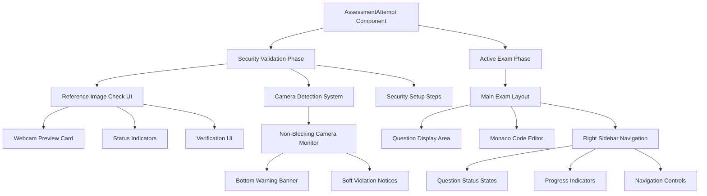
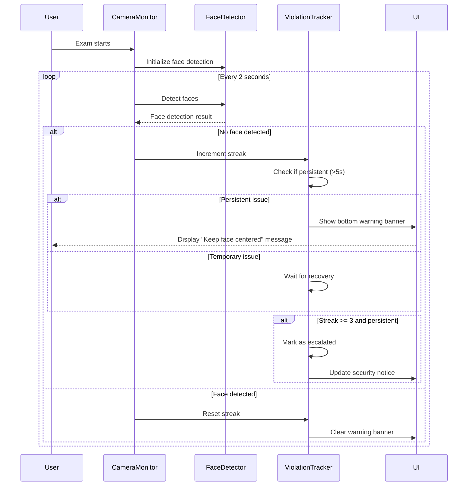
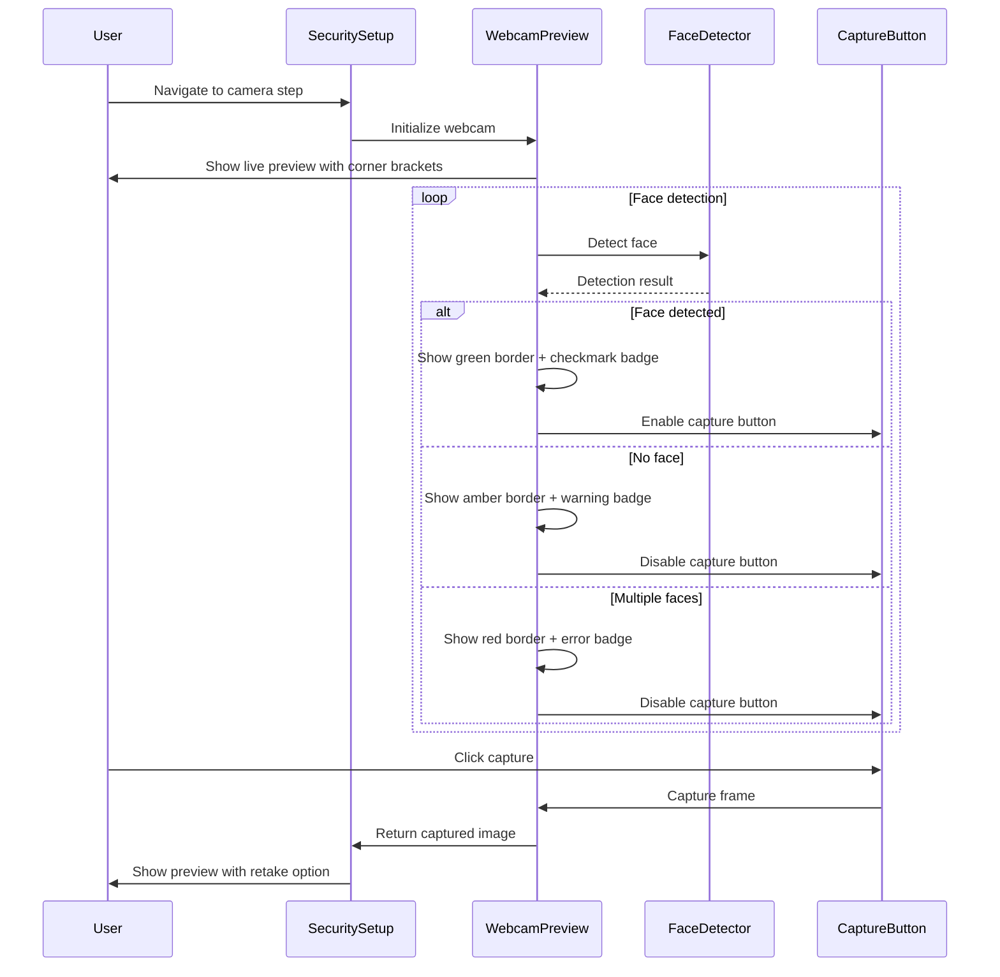
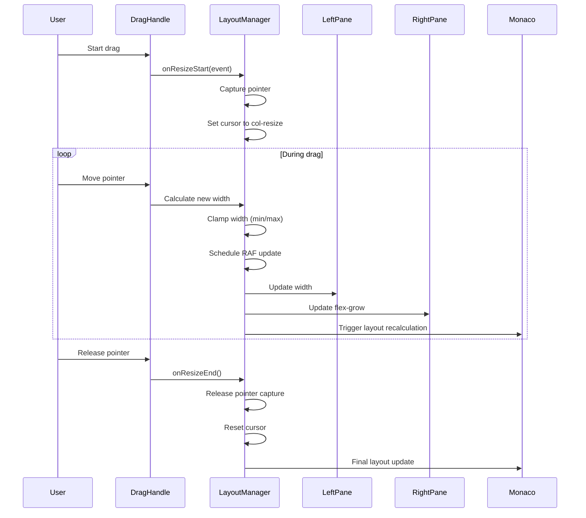

# Design Document: Assessment Exam Flow UI/UX Improvements

## Overview

This design focuses on improving the assessment exam flow UI/UX to create a professional, enterprise-level assessment platform experience. The improvements target five key areas: non-blocking camera detection, reference image check UI redesign, assessment start screen polish, right sidebar redesign, and overall visual consistency. All changes are frontend-only and preserve existing functionality while enhancing user experience through modern design patterns, smooth animations, and better visual hierarchy.

## Architecture



## Components and Interfaces

### Component 1: Non-Blocking Camera Detection System

**Purpose**: Monitor camera status during exam without interrupting the exam flow for temporary camera issues

**Interface**:
```typescript
interface CameraMonitorProps {
  cameraRequired: boolean;
  streamRef: React.RefObject<MediaStream>;
  onViolation: (type: string, message: string, meta: object) => void;
  securityNotice: string;
  setSecurityNotice: (message: string) => void;
  cameraIndicator: 'idle' | 'normal' | 'warning';
  setCameraIndicator: (status: 'idle' | 'normal' | 'warning') => void;
}

interface CameraStatusBanner {
  visible: boolean;
  message: string;
  severity: 'info' | 'warning' | 'error';
  dismissible: boolean;
}
```

**Responsibilities**:
- Monitor camera feed continuously during active exam phase
- Display non-intrusive bottom banner for camera warnings
- Track camera violation streaks before escalating
- Avoid reopening security check page for temporary issues
- Only trigger violations for persistent suspicious activity

**Visual Design**:
- Bottom-fixed banner with slide-up animation
- Color-coded severity: blue (info), amber (warning), red (error)
- Icon + message + optional dismiss button
- Translucent backdrop with blur effect
- Auto-dismiss after 10 seconds for non-critical warnings

### Component 2: Reference Image Check UI

**Purpose**: Provide a modern, professional interface for webcam verification during security setup

**Interface**:
```typescript
interface ReferenceImageCheckProps {
  validationVideoRef: React.RefObject<HTMLVideoElement>;
  faceStatus: 'idle' | 'detecting' | 'detected' | 'no_face' | 'multiple_faces';
  onCapture: () => Promise<void>;
  onRetake: () => void;
  isCapturing: boolean;
  capturedImage: string | null;
}

interface WebcamPreviewCard {
  borderStyle: 'default' | 'detecting' | 'success' | 'error';
  showCornerBrackets: boolean;
  statusIndicator: {
    visible: boolean;
    text: string;
    icon: React.ReactNode;
    color: string;
  };
  overlayAnimation: 'pulse' | 'scan' | 'none';
}
```

**Responsibilities**:
- Display live webcam preview with professional styling
- Show real-time face detection status with visual feedback
- Provide clear capture and retake controls
- Display status indicators with icons and animations
- Handle reflection-free layout with proper spacing

**Visual Design**:
- Rounded card with gradient border (changes color based on status)
- Corner bracket overlay for camera framing guide
- Animated status badge (top-right): detecting (pulse), detected (checkmark), error (alert)
- Smooth transitions between states
- Shadow and backdrop blur for depth
- Centered layout with proper padding and margins

### Component 3: Assessment Start Screen Layout

**Purpose**: Ensure proper alignment, spacing, and responsiveness of the main exam interface

**Interface**:
```typescript
interface AssessmentLayoutProps {
  leftWidth: number;
  onResize: (width: number) => void;
  sidebarExpanded: boolean;
  sidebarPinned: boolean;
  onSidebarToggle: () => void;
}

interface SplitPaneLayout {
  leftPane: {
    minWidth: number;
    maxWidth: number;
    content: 'question' | 'problem';
  };
  rightPane: {
    content: 'editor' | 'answer';
    flexGrow: boolean;
  };
  resizable: boolean;
  dragHandle: {
    width: number;
    hoverEffect: boolean;
  };
}
```

**Responsibilities**:
- Manage split-pane layout with resizable divider
- Ensure Monaco editor proper height calculation
- Handle responsive breakpoints for mobile/tablet
- Prevent overlapping components
- Maintain consistent spacing and alignment
- Support dynamic content resizing

**Visual Design**:
- Clean split-pane with subtle divider
- Drag handle with hover effect (color change + cursor)
- Smooth resize with requestAnimationFrame
- Minimum/maximum width constraints
- Proper padding and margins throughout
- No layout shift or flickering

### Component 4: Right Sidebar Navigation

**Purpose**: Provide intuitive question navigation with clear visual states

**Interface**:
```typescript
interface QuestionNavigationProps {
  questions: QuestionItem[];
  activeQuestion: number;
  onQuestionSelect: (index: number) => void;
  questionStatus: (secIdx: number, qIdx: number) => 'answered' | 'unanswered' | 'review';
  markedForReview: Set<string>;
  expanded: boolean;
  pinned: boolean;
}

interface QuestionItem {
  sectionIndex: number;
  questionIndex: number;
  number: number;
  type: 'mcq' | 'coding' | 'text';
  status: 'answered' | 'unanswered' | 'review' | 'current';
}

interface QuestionStatusStyles {
  answered: {
    background: string;
    border: string;
    text: string;
    icon: React.ReactNode;
  };
  unanswered: {
    background: string;
    border: string;
    text: string;
    icon: React.ReactNode;
  };
  review: {
    background: string;
    border: string;
    text: string;
    icon: React.ReactNode;
  };
  current: {
    background: string;
    border: string;
    text: string;
    icon: React.ReactNode;
    ring: string;
  };
}
```

**Responsibilities**:
- Display all questions with visual status indicators
- Highlight current question prominently
- Show answered, unanswered, flagged states clearly
- Provide hover effects for better interactivity
- Support collapsible/expandable sidebar
- Enable pinning sidebar for persistent visibility

**Visual Design**:
- Grid layout for question numbers
- Color-coded status:
  - Current: Sky blue with ring
  - Answered: Green background
  - Unanswered: Gray background
  - Flagged: Amber background with flag icon
- Smooth hover transitions (scale + shadow)
- Progress bar at top showing completion
- Section headers with counts
- Collapse/expand animation (slide + fade)
- Pin button (top-right) to lock sidebar open

### Component 5: Overall Polish & Consistency

**Purpose**: Ensure consistent design language across all exam components

**Interface**:
```typescript
interface DesignTokens {
  colors: {
    primary: string;
    secondary: string;
    success: string;
    warning: string;
    error: string;
    neutral: Record<number, string>;
  };
  spacing: Record<string, string>;
  borderRadius: Record<string, string>;
  shadows: Record<string, string>;
  transitions: Record<string, string>;
  typography: {
    fontFamily: string;
    fontSize: Record<string, string>;
    fontWeight: Record<string, number>;
    lineHeight: Record<string, string>;
  };
}

interface AnimationConfig {
  duration: number;
  easing: string;
  delay?: number;
}
```

**Responsibilities**:
- Define consistent color palette
- Standardize spacing and sizing
- Unify border radius and shadows
- Establish transition timing
- Ensure typography hierarchy
- Prevent layout shift and flickering

**Visual Design**:
- Consistent rounded corners (8px, 12px, 16px, 24px, 30px)
- Unified shadow system (subtle to prominent)
- Smooth transitions (200ms ease-in-out)
- Color hierarchy: primary (sky), success (emerald), warning (amber), error (rose)
- Typography scale: xs (11px), sm (13px), base (15px), lg (17px), xl (20px)
- Spacing scale: 1 (4px), 2 (8px), 3 (12px), 4 (16px), 6 (24px), 8 (32px)

## Data Models

### CameraViolationState

```typescript
interface CameraViolationState {
  type: 'camera_loss' | 'camera_no_face' | 'multiple_faces' | 'face_out_of_frame';
  count: number;
  lastDetected: number; // timestamp
  streak: number;
  escalated: boolean;
  persistent: boolean; // true if issue lasts > 5 seconds
}
```

**Validation Rules**:
- `count` must be non-negative integer
- `lastDetected` must be valid timestamp
- `streak` resets to 0 if issue resolves for > 3 seconds
- `escalated` becomes true only if `streak >= 3` and `persistent === true`

### SecurityNoticeState

```typescript
interface SecurityNoticeState {
  visible: boolean;
  message: string;
  severity: 'info' | 'warning' | 'error';
  timestamp: number;
  dismissible: boolean;
  autoDismissMs: number | null;
}
```

**Validation Rules**:
- `message` must be non-empty string when `visible === true`
- `severity` must be one of the three allowed values
- `autoDismissMs` must be positive integer or null
- `timestamp` must be valid timestamp

### QuestionNavigationState

```typescript
interface QuestionNavigationState {
  activeSection: number;
  activeQuestion: number;
  answersMap: Record<string, AnswerValue>;
  markedMap: Record<string, boolean>;
  sidebarExpanded: boolean;
  sidebarPinned: boolean;
  navTypeFilter: 'all' | 'answered' | 'unanswered' | 'review';
}

interface AnswerValue {
  answer?: string | number;
  code?: string;
  language?: string;
}
```

**Validation Rules**:
- `activeSection` and `activeQuestion` must be valid indices
- `answersMap` keys must follow format `{sectionIndex}-{questionIndex}`
- `navTypeFilter` must be one of the four allowed values
- `sidebarPinned` can only be true if `sidebarExpanded === true`

### LayoutState

```typescript
interface LayoutState {
  leftWidth: number;
  consoleHeight: number;
  editorHeight: number;
  splitContainerWidth: number;
  minLeftWidth: number;
  maxLeftWidth: number;
  minEditorHeight: number;
}
```

**Validation Rules**:
- `leftWidth` must be between `minLeftWidth` and `maxLeftWidth`
- `editorHeight` must be >= `minEditorHeight`
- `consoleHeight` must be >= 96 (minimum console height)
- All dimensions must be positive integers

## Sequence Diagrams

### Non-Blocking Camera Detection Flow



### Reference Image Check UI Flow



### Assessment Layout Resize Flow



## Error Handling

### Error Scenario 1: Camera Access Denied

**Condition**: User denies camera permission or camera is unavailable
**Response**: 
- Display clear error message in webcam preview card
- Show "Camera access required" with instructions to enable
- Provide "Retry" button to request permission again
- Do not block exam start if camera is optional

**Recovery**: 
- User grants permission → Reinitialize camera stream
- User keeps denying → Allow exam start with warning logged

### Error Scenario 2: Face Detection API Unavailable

**Condition**: Browser doesn't support FaceDetector API
**Response**:
- Gracefully degrade to basic camera monitoring
- Log warning in console
- Continue with camera stream validation only
- Do not show face-specific warnings

**Recovery**:
- Use fallback detection (check if video stream is active)
- Rely on manual review of recorded footage

### Error Scenario 3: Layout Calculation Failure

**Condition**: ResizeObserver fails or container dimensions are invalid
**Response**:
- Use fallback dimensions (default widths/heights)
- Log error to console
- Prevent negative or zero dimensions
- Ensure minimum usable space for editor and question pane

**Recovery**:
- Retry layout calculation on next resize event
- User can manually adjust split pane to trigger recalculation

### Error Scenario 4: Monaco Editor Mount Failure

**Condition**: Monaco editor fails to initialize or mount
**Response**:
- Display error message in editor container
- Provide "Reload Editor" button
- Log detailed error to console
- Preserve user's code in state

**Recovery**:
- User clicks reload → Remount Monaco with saved code
- If persistent → Fall back to textarea with syntax highlighting

## Testing Strategy

### Unit Testing Approach

**Component Tests**:
- Test camera monitor state transitions (idle → normal → warning)
- Test violation streak calculation and escalation logic
- Test layout dimension clamping functions
- Test question status calculation (answered/unanswered/review)
- Test sidebar expand/collapse animations

**Hook Tests**:
- Test `useLayoutResize` hook with various container sizes
- Test `useCameraMonitor` hook with mock MediaStream
- Test `useQuestionNavigation` hook state updates

**Utility Tests**:
- Test `clampLeftWidth` with edge cases (min, max, invalid)
- Test `normalizeRunCaseStatus` with all status types
- Test `formatTime` with various millisecond values

**Coverage Goals**: 80% line coverage, 90% branch coverage for critical paths

### Integration Testing Approach

**User Flow Tests**:
1. Complete security setup flow (environment → camera → location → fullscreen)
2. Navigate through questions using sidebar
3. Resize split pane and verify editor responsiveness
4. Trigger camera warning and verify bottom banner appears
5. Submit exam and verify all data is saved

**Cross-Browser Tests**:
- Test on Chrome, Firefox, Safari, Edge
- Verify FaceDetector API fallback on unsupported browsers
- Test responsive layout on mobile/tablet viewports

**Accessibility Tests**:
- Keyboard navigation through question sidebar
- Screen reader announcements for status changes
- Focus management during modal transitions
- Color contrast validation (WCAG AA)

## Performance Considerations

**Camera Monitoring**:
- Throttle face detection to every 2 seconds (avoid excessive CPU usage)
- Use `requestAnimationFrame` for smooth canvas updates
- Debounce violation logging to prevent API spam
- Clean up video streams on component unmount

**Layout Calculations**:
- Use `requestAnimationFrame` for resize updates (avoid layout thrashing)
- Debounce ResizeObserver callbacks (300ms)
- Cache computed dimensions to avoid recalculation
- Use CSS transforms for animations (GPU-accelerated)

**Monaco Editor**:
- Lazy load Monaco editor bundle (code splitting)
- Debounce code change events (500ms)
- Use virtual scrolling for large code files
- Dispose editor instance on unmount to free memory

**Rendering Optimization**:
- Use `React.memo` for question navigation items
- Memoize expensive calculations (question status, progress counts)
- Use CSS containment for isolated components
- Avoid inline function definitions in render

## Security Considerations

**Camera Stream Handling**:
- Ensure camera stream is stopped when not needed
- Do not transmit video frames to server (only metadata)
- Validate face detection results before logging violations
- Prevent unauthorized access to camera feed

**Violation Logging**:
- Sanitize violation messages before sending to server
- Rate-limit violation API calls (max 1 per second per type)
- Validate violation types against whitelist
- Include timestamp and metadata for audit trail

**Data Privacy**:
- Do not store captured reference images longer than necessary
- Encrypt sensitive exam data in transit (HTTPS)
- Clear local storage on exam submission
- Respect user's privacy settings

## Dependencies

**Frontend Libraries**:
- React 19.1.1 (UI framework)
- Tailwind CSS 3.4.17 (styling)
- Lucide React 0.544.0 (icons)
- Framer Motion 11.11.17 (animations)
- Monaco Editor (code editing)

**Browser APIs**:
- MediaStream API (camera access)
- FaceDetector API (face detection, optional)
- ResizeObserver API (layout monitoring)
- Fullscreen API (fullscreen mode)
- Pointer Events API (drag interactions)

**Backend APIs** (existing, no changes):
- `GET /api/student/assessments/:id` (fetch assessment)
- `POST /api/student/assessments/:id/submit` (submit answers)
- `POST /api/student/assessments/:id/violations` (log violations)
- `POST /api/student/assessments/:id/save` (auto-save progress)

**Development Tools**:
- Vite 7.1.7 (build tool)
- ESLint 9.36.0 (linting)
- TypeScript types (type checking)
