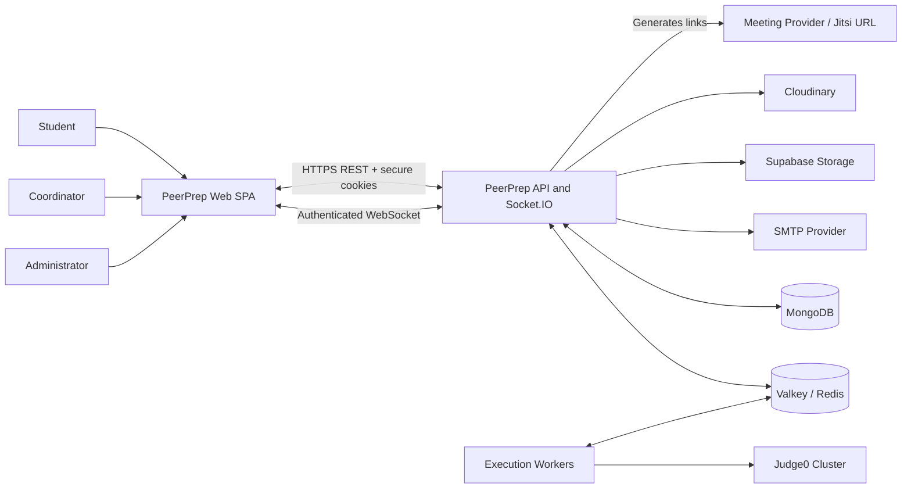
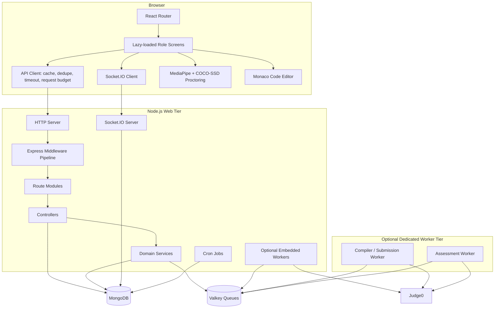
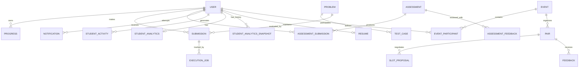
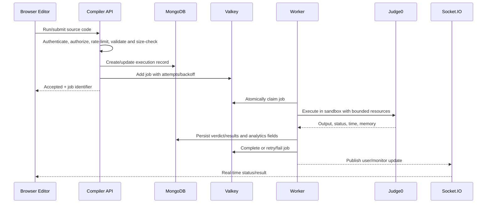
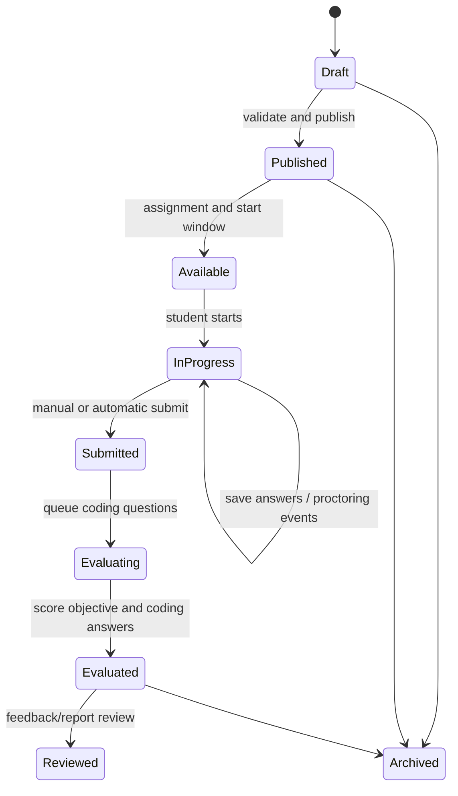
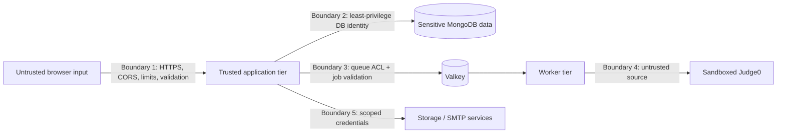
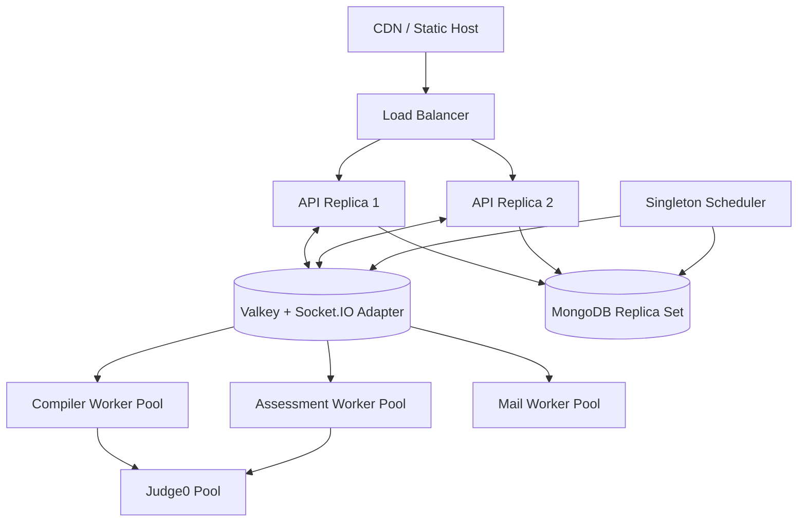

# PeerPrep System Architecture

**Document type:** As-built architecture with production evolution guidance  
**Repository scope:** `frontend/`, `backend/`, and supporting infrastructure  
**Last reviewed:** 9 September 2026

---

## 1. Purpose and scope

PeerPrep is a role-based placement-preparation platform for students, coordinators, and administrators. It combines learning content, coding practice, timed assessments, browser-assisted proctoring, interview pairing and scheduling, feedback, analytics, notifications, email, student onboarding, and resume management.

This document describes the system as implemented in this repository. It covers:

- runtime components and their responsibilities;
- frontend and backend boundaries;
- data ownership and persistence;
- authentication, authorization, and trust boundaries;
- synchronous, asynchronous, and real-time communication;
- critical end-to-end workflows;
- availability, scalability, security, observability, and deployment concerns;
- known architectural risks and a practical target architecture.

The system is currently a **modular monolith with asynchronous workers**. Business domains share one Express application and MongoDB database, while resource-heavy code execution can run through Valkey-backed queues and separately scalable worker processes.

## 2. Architectural drivers

The architecture is shaped by the following requirements:

1. **Role isolation:** students, coordinators, and administrators must see and execute only permitted operations.
2. **Assessment integrity:** timed attempts, answer persistence, scoring, and proctoring evidence must remain internally consistent.
3. **Untrusted code isolation:** submitted programs must never execute inside the API process.
4. **Interactive responsiveness:** dashboards and coding workflows need bounded latency and real-time status updates.
5. **Bulk operations:** onboarding, assessment assignment, notifications, and email can fan out to many students.
6. **Recoverability:** queued execution must tolerate transient worker and upstream failures.
7. **Operational simplicity:** local development can run most components from one backend process, while production can separate workers.
8. **Data privacy:** identity, academic results, resumes, and proctoring events are sensitive data.

## 3. System context



### 3.1 Actors

| Actor | Primary responsibilities |
|---|---|
| Student | Complete learning activities, solve coding problems, take assessments, participate in interviews, provide feedback, inspect analytics, and maintain a resume. |
| Coordinator | Operate only delegated modules, generally within assigned academic scope; manage students, subjects, events, assessments, compiler content, or analytics when granted the corresponding permission. |
| Administrator | Operate all platform modules, provision coordinators, assign coordinator permissions, onboard students, configure content, and inspect system-wide reports. |
| Operator | Deploy and configure the application, MongoDB, Valkey, workers, storage, email, and Judge0; monitor availability and recover failed infrastructure. |

### 3.2 External dependencies

| Dependency | Purpose | Failure impact |
|---|---|---|
| MongoDB | System-of-record database | Most authenticated functionality is unavailable. |
| Valkey/Redis | Rate-limit backing and durable execution queues | Queued compiler and assessment execution is unavailable or degraded; distributed rate limiting may degrade depending on configuration. |
| Judge0 | Sandboxed compilation and program execution | Code run and submission evaluation fail; the rest of the platform remains usable. |
| SMTP | Transactional onboarding, reset, event, and reminder email | Core records may still be created, but email delivery is delayed or failed. |
| Supabase Storage | Event/template file storage and signed download URLs | Template upload/download is unavailable. |
| Cloudinary | Profile avatar storage and transformation | Avatar mutations fail; existing remote images may remain readable. |
| Meeting URL provider | Generated interview room links | Scheduled records remain available, but participants may be unable to join meetings. |

## 4. Runtime architecture



### 4.1 Deployable units

| Unit | Entry point | Responsibility | Scaling model |
|---|---|---|---|
| Frontend | `frontend/src/main.jsx` | Static React SPA built by Vite | CDN/static-host horizontal delivery. |
| API/websocket server | `backend/src/server.js` | REST, cookies, Socket.IO, scheduled jobs, initialization, and optionally workers | Horizontal Node.js replicas, subject to websocket and cron coordination. |
| Compiler worker | `backend/src/workers/compiler.worker.js` | Consume compiler/submission jobs and call Judge0 | Scale by worker replicas and concurrency. |
| Assessment worker | `backend/src/workers/assessment.worker.js` | Consume assessment execution jobs and persist outcomes | Scale independently from interactive compilation. |
| Mail worker | `backend/src/workers/mailQueue.worker.js` | Process durable mail jobs | Currently started by the API process; should have singleton/claim safety across replicas. |

`START_EXECUTION_WORKERS` controls whether execution workers are embedded in the API. Embedded mode is convenient for development and a single server. In a multi-replica production environment, set it to false on web replicas and run dedicated workers to prevent every API instance from adding uncontrolled execution concurrency.

### 4.2 Backend startup lifecycle

1. Load environment variables from the process directory, `backend/.env`, and `backend/src/.env` without overwriting existing values.
2. Connect to MongoDB. Development can use or fall back to `mongodb-memory-server`; production fails closed.
3. Seed the administrator when configured and seed default email templates.
4. Create the HTTP server around Express.
5. Attach Socket.IO with origin validation and JWT authentication.
6. Register Socket.IO for application-wide notification use.
7. Start optional execution workers and the mail worker.
8. Start listening and asynchronously verify the SMTP transport.
9. On `SIGTERM` or `SIGINT`, stop accepting HTTP traffic, close websockets, close MongoDB, and enforce a ten-second shutdown ceiling.

## 5. Frontend architecture

### 5.1 Structure

The frontend is a React 19 single-page application using React Router, Vite, Tailwind/CSS, and route-level lazy loading. It is organized primarily by role and feature:

- `student/`: student dashboard, learning, interviews, assessments, coding, analytics, feedback, profile, and resume;
- `admin/`: administration, onboarding, directory, events, assessments, question library, compiler management, reports, announcements, and company insights;
- `coordinator/`: coordinator shells and scoped operational screens;
- `features/assessment/`: reusable assessment and proctoring components;
- `components/`: navigation, layout, notifications, charts, calendars, and shared UI;
- `context/`: authentication and theme state;
- `utils/`: API base URL, request client, websocket setup, and common helpers.

Vite creates stable vendor chunks for React, animation, and Socket.IO. Route-level dynamic imports keep expensive modules such as Monaco, PDF rendering, TensorFlow, and MediaPipe out of the initial landing-page path where possible.

### 5.2 Navigation and access enforcement

The route tree has three protected shells:

- `StudentProtectedRoute` requires an authenticated student and applies password-change rules.
- `AdminShell` wraps administrator pages.
- `CoordinatorShell` requires both the coordinator role and an explicit permission string such as `coordinator.assessment.create` or `coordinator.compiler.analytics`.

Frontend guards improve usability but are **not a security boundary**. Every sensitive API route must independently authenticate the caller and enforce role, permission, ownership, and academic-scope checks.

### 5.3 API client behavior

The shared API client sends `credentials: include`, allowing the browser to attach HttpOnly authentication cookies. It implements:

- short-lived in-memory GET caching;
- stale-while-revalidate behavior;
- duplicate in-flight GET coalescing;
- a configurable browser request timeout;
- a maximum concurrent request budget and bounded wait queue;
- cache invalidation after mutations;
- cleanup of the legacy local-storage token.

This cache is per browser tab/process, is not durable, and must never be treated as authoritative. Server-side authorization and current database state always win.

### 5.4 Browser proctoring

Assessment proctoring runs client-side using MediaPipe vision tasks and TensorFlow COCO-SSD. Detector and rule modules identify configured signals such as face, gaze, or prohibited-object conditions. A violation buffer batches evidence/events before sending them to the backend. The server validates event shape, applies server-side rules, stores violations with the assessment submission, and exposes reports to authorized reviewers.

Browser inference reduces server compute and avoids continuously streaming video. It does not make the browser trusted: a modified client can suppress events. Proctoring output should therefore be presented as review evidence or a risk signal, not as an unquestionable determination of misconduct.

## 6. Backend application architecture

The backend follows a route-controller-service-model pattern:

```text
HTTP request
  -> global middleware
  -> route-specific authentication/authorization/validation
  -> controller orchestration
  -> domain service(s)
  -> Mongoose model(s) / queue / external integration
  -> normalized response or centralized error handler
```

### 6.1 Middleware pipeline

Requests pass through these major controls in order:

1. response compression;
2. Helmet security headers;
3. configured-origin CORS with credentials;
4. cookie parsing;
5. JSON and URL-encoded body parsing with a 2 MB limit;
6. MongoDB operator sanitization;
7. XSS sanitization, with executable source fields preserved and compiler/execution routes excluded to avoid corrupting code;
8. environment-appropriate request logging;
9. API request deadlines, including longer budgets for selected operations;
10. general and endpoint-specific rate limiting;
11. route authentication, authorization, validation, and controller execution;
12. 404 and centralized error handling.

### 6.2 Domain modules

| Domain | API prefix | Main responsibility |
|---|---|---|
| Authentication | `/api/auth` | Login/logout, session validation, password changes and resets, current-user identity, initial admin seed. |
| Students | `/api/students` | Onboarding, directory, student records, uploads, profile operations, and promotion. |
| Coordinators | `/api/coordinators` | Provisioning, activation, profile, scope, and granular permission management. |
| Learning | `/api/subjects`, `/api/learning` | Semesters, subjects, chapters/topics, and progress. |
| Interviews | `/api/events`, `/api/pairing`, `/api/schedule`, `/api/feedback` | Events, participants, pairs, slot negotiation, meeting links, attendance, and peer feedback. |
| Coding | `/api/compiler`, `/api/execute` | Problem administration, practice runs, submissions, execution status, and analytics. |
| Assessments | `/api/admin`, `/api/student`, `/api/assessment-feedback` | Authoring, assignment, attempts, answers, scoring, proctoring, reports, and feedback. |
| Analytics | `/api/activity`, `/api/student/analysis`, `/api/results` | Activity ingestion, computed student metrics, snapshots, history, and results. |
| Messaging | `/api/notifications`, announcement routes, `/api/email-templates`, `/api/mail-queue` | In-app notifications, announcements, transactional templates, and email delivery status. |
| Career artifacts | `/api/resume`, `/api/admin/company-insights` | Resume revisions and company benchmark/placement insights. |

### 6.3 Scheduled jobs

- `jobs/reminders.js` finds upcoming interview activity and triggers relevant notifications/email.
- `jobs/analytics.js` refreshes or materializes analytics.

These jobs are imported by `server.js`, so each API replica may register them. Production with more than one web replica requires a distributed lock, leader election, or a separate singleton scheduler; otherwise duplicate work and duplicate messages are possible.

## 7. Data architecture

MongoDB is the authoritative store. Mongoose provides schemas, validation, indexes, references, timestamps, and model-level password hashing. Valkey contains transient queue state and may back rate limits; it is not the authoritative store for student results.

### 7.1 Logical data domains

| Domain | Collections/models | Notes |
|---|---|---|
| Identity and access | `User`, `SpecialStudent` | Credentials, role, activation/session state, coordinator permissions, and profile/academic identity. Passwords are bcrypt hashes. |
| Learning | `Semester` (with subjects/chapters/topics), `Progress` | Curriculum hierarchy and per-student learning completion/metrics. |
| Interviews | `Event`, `EventParticipant`, `Pair`, `SlotProposal`, `Feedback` | Event configuration, participation, pairing, proposed times, scheduled session state, and feedback. |
| Coding | `Problem`, `TestCase`, `Submission`, `ExecutionJob` | Problem metadata and code templates, protected test data, per-attempt outcomes, and durable execution tracking. |
| Assessments | `Assessment`, `AssessmentSubmission`, `AssessmentFeedback`, `QuestionLibrary` | Embedded sections/questions/settings, assigned attempts, answer and score state, proctoring violations, reusable questions, and reviewer feedback. |
| Analytics and audit | `Activity`, `StudentActivity`, `StudentAnalytics`, `StudentAnalyticsSnapshot` | Administrative audit/activity, student events, current computed analytics, and historical snapshots. |
| Messaging | `Notification`, `Announcement`, `EmailTemplate`, `MailJob` | User-targeted notifications, broadcasts, editable message templates, and durable delivery records. |
| Administration/career | `StudentUploadBatch`, `CompanyBenchmark`, `Resume` | Bulk import traceability, placement comparison data, and versioned resume content. |

### 7.2 Conceptual relationship model



This diagram is conceptual: some links are stored as MongoDB `ObjectId` references, while other assessment content and result details are embedded subdocuments. Consult the schemas before changing cardinality or adding cascade behavior.

### 7.3 Data consistency model

- Most single-document mutations are atomic through MongoDB.
- Multi-document workflows are orchestrated in controllers/services and may be eventually consistent unless explicitly wrapped in a transaction.
- Notifications, analytics, and email are derived side effects and can lag behind the initiating write.
- Queue records are transient coordination state; durable `ExecutionJob`, `Submission`, `AssessmentSubmission`, and `MailJob` documents preserve user-visible status.
- API mutations that may be retried should use stable identifiers, uniqueness constraints, or state-transition guards to avoid duplicates.

### 7.4 Data lifecycle and privacy

The repository does not define one global retention policy. Before production use, specify retention and deletion behavior for:

- authentication/session and password-reset metadata;
- source code and detailed testcase outcomes;
- assessment answers and proctoring violations;
- resumes and uploaded profile imagery;
- activity/audit logs and analytics snapshots;
- emails and queue error payloads;
- event templates in external object storage.

Account deletion must account for both MongoDB records and external assets. Analytics and audit requirements may justify pseudonymization rather than immediate physical deletion, subject to the applicable policy and law.

## 8. Authentication and authorization

### 8.1 Authentication flow

```mermaid
sequenceDiagram
    participant B as Browser
    participant A as Auth API
    participant M as MongoDB
    participant W as Socket.IO

    B->>A: POST credentials
    A->>M: Find user and verify bcrypt hash
    A->>M: Record active-session token hash/state
    A-->>B: Set HttpOnly cookie + sanitized user
    B->>A: Authenticated REST request (cookie)
    A->>A: Verify JWT, session replacement, password-change state
    A->>M: Authorize role/permission/scope
    A-->>B: Response
    B->>W: WebSocket handshake with cookie
    W->>M: Load current user/session state
    W-->>B: Join own user room; optional monitor room
```

The preferred JWT transport is an HttpOnly cookie. Socket authentication also supports an authorization/auth payload fallback for migration compatibility. The server hashes the active token and compares it with the user record so a newer login can replace an older session. Tokens issued before `passwordChangedAt` are rejected.

Cookie security depends on deployment configuration. Production must use HTTPS and deliberate `Secure`, `SameSite`, domain, path, expiration, and CSRF controls. Because cookie credentials are automatically attached by browsers, CORS alone is not a complete CSRF defense for state-changing endpoints.

### 8.2 Authorization layers

1. **Authentication:** valid JWT plus active user/session state.
2. **Role check:** student, coordinator, or administrator.
3. **Permission check:** granular coordinator capability such as view, create, edit, manage, or analytics.
4. **Resource ownership:** student-owned submissions, attempts, feedback, resume, and analytics.
5. **Academic/organizational scope:** coordinator access constrained to assigned students, semesters, courses, or records.
6. **State transition:** an operation is allowed only in a compatible lifecycle state—for example, an assessment cannot be submitted twice or edited after an invalid transition.

Administrators bypass many coordinator permission checks by design, but still pass authentication and input validation.

## 9. Code execution architecture

Untrusted source code is delegated to Judge0; it is never executed by Node.js. The platform accepts supported language identifiers, bounds source and input sizes, clamps CPU/wall-clock/memory limits, sends Base64-encoded payloads to Judge0, normalizes output, maps Judge0 statuses, and compares output for judged submissions.

### 9.1 Queue topology

Three logical Valkey queues isolate workloads:

- `compiler`: interactive run jobs;
- `submission`: judged practice submissions;
- `assessment`: assessment coding evaluation.

Each job has a Valkey hash plus waiting, processing, and delayed data structures. Workers use blocking moves to claim work (`BLMOVE`, with `BRPOPLPUSH` compatibility), heartbeat active jobs, retry with increasing backoff, promote delayed jobs, and recover stalled jobs atomically with Lua. Job state is mirrored to MongoDB where a durable user-visible record is required.

### 9.2 Execution sequence



### 9.3 Isolation and capacity controls

- Separate interactive and assessment queues prevent one workload from completely blocking the other.
- Worker concurrency is configurable and clamped in embedded mode.
- Multiple Judge0 base URLs are selected round-robin and retried on eligible upstream failures.
- Request, polling, source size, stdin size, testcase size, CPU, wall-time, and memory limits bound resource consumption.
- Per-user run/submit rate limits and cooldowns reduce abuse.
- Production Judge0 must be network-isolated, patched, capacity-limited, and configured with container/process sandboxing. The API should reach it over a private network; browsers should not access it directly.

## 10. Assessment lifecycle



Exact persisted status names should be taken from the schemas/controllers; this diagram expresses the logical lifecycle.

### 10.1 Authoring

An administrator or authorized coordinator builds sections and questions, optionally imports students by CSV, selects reusable library questions/problems, sets timing and attempt settings, and configures AI-proctoring rules. The backend validates the assessment and persists its embedded content and settings.

### 10.2 Attempt and autosave

The student obtains an authorized assessment view without protected answers/testcases, starts an attempt within the allowed window, and periodically persists answers. Server time and stored attempt state—not the browser clock—must determine expiry. Each save verifies attempt ownership and mutable state.

### 10.3 Submission and scoring

Objective responses can be scored synchronously. Coding responses are queued for sandboxed execution. `assessmentScoringService` consolidates section/question scores, while submission state communicates whether evaluation is pending or complete. Repeated submit requests must return the existing terminal result rather than enqueue duplicate evaluations.

### 10.4 Reporting

Student reports expose only permitted feedback and answer details. Administrative/coordinator reports can expose broader scoring, violations, and cohort aggregations subject to permission and scope. Reviewer feedback is stored separately from the immutable evidence used to calculate the original result.

## 11. Interview scheduling lifecycle

1. An authorized operator creates an event and selects eligible students.
2. Event participants are recorded; pairing logic produces `Pair` records.
3. Participants exchange `SlotProposal` options.
4. An accepted slot transitions the pair to scheduled state and generates a unique meeting URL from `MEETING_LINK_BASE`.
5. Notifications and optional email/ICS attachments communicate the schedule.
6. Reminder jobs find upcoming sessions and send reminders.
7. After the session, participants submit `Feedback`; analytics consume completion and rating data.

Concurrency is important when accepting slots: competing accept requests should use a conditional update or transaction so only one final schedule wins.

## 12. Notifications, email, and real-time communication

### 12.1 In-app notifications

Notifications are persisted in MongoDB and delivered through Socket.IO for immediacy. Every authenticated socket joins a server-selected personal room based on the verified user ID. Client-provided registration IDs cannot redirect the socket into another user’s room. Authorized compiler monitors also join `compiler:monitor`.

Socket controls include:

- origin validation;
- JWT and current-user lookup during handshake;
- disabled coordinator rejection;
- active-session and password-change checks;
- at most ten concurrent connections per user in a process;
- per-event per-socket rate limiting.

The connection count is process-local. A multi-replica deployment needs a Socket.IO Redis/Valkey adapter for cross-node room delivery and, if a global limit is required, a distributed connection counter. Otherwise a client connected to replica A will not receive an event emitted only on replica B.

### 12.2 Email

Email templates live in MongoDB and are seeded on startup. Nodemailer uses a pooled SMTP transport with TLS, timeouts, configurable connection/message limits, global enablement, and per-feature switches. Durable `MailJob` records and the mail worker decouple bulk delivery from interactive endpoints.

Email delivery is at-least-once unless provider/message idempotency is added. Retries can cause duplicates. Store a deterministic logical message key and enforce uniqueness for high-value messages such as onboarding and scheduled-session confirmations.

## 13. Analytics architecture

Analytics is derived from operational evidence including assessments, code submissions, learning progress, interviews, feedback, and student activity. The architecture separates:

- raw/operational records, which remain the evidence source;
- `StudentActivity`, an event-like activity history;
- `StudentAnalytics`, the current computed view;
- `StudentAnalyticsSnapshot`, historical point-in-time values.

The analytics engine computes domain and topic metrics plus explanations/evidence. Scheduled refreshes support dashboard performance; explicit refresh endpoints are separately rate-limited. Derived analytics should be rebuildable from source records where practical. Version the calculation algorithm so score changes can be explained across snapshots.

## 14. Storage and integration boundaries

### 14.1 Supabase Storage

Event templates are uploaded server-side to a configurable bucket. A public bucket yields a public URL; a private bucket yields signed URLs with a configurable TTL. Service credentials remain backend-only. Private buckets are preferred for student- or institution-specific content.

### 14.2 Cloudinary

Profile avatars are uploaded as streams, cropped to a face-focused square, transformed, and served through secure Cloudinary URLs. Replacement/deletion workflows must avoid orphaned assets and must validate MIME type, decoded file signature, and size before upload.

### 14.3 Judge0

Judge0 is an execution service, not a data store. PeerPrep owns job identity, authorization, retry policy, final verdict, and user-visible persistence. Judge0 owns isolated compilation/execution and low-level status/resource measurements.

### 14.4 SMTP and meeting links

SMTP is outbound-only. Meeting integration currently creates URLs from a configured base rather than provisioning rooms through a provider API. Anyone possessing an insufficiently random meeting URL may be able to join; generated room identifiers must have high entropy and avoid personal information.

## 15. Security architecture

### 15.1 Trust boundaries



### 15.2 Implemented controls

- bcrypt password hashing;
- signed JWT authentication with HttpOnly-cookie transport;
- active-session replacement and password-change invalidation;
- role, coordinator-permission, ownership, and scope middleware;
- production origin allowlisting for HTTP and websocket traffic;
- Helmet, request size limits, NoSQL sanitization, and selective XSS sanitization;
- endpoint-specific rate limiting and cooldowns;
- bounded request and upstream execution timeouts;
- authenticated socket rooms and connection/event limits;
- Judge0 isolation for untrusted code;
- private/signed storage URL support;
- TLS-capable SMTP and masked MongoDB connection logging.

### 15.3 Required production hardening

1. Add or verify CSRF protection for cookie-authenticated mutations; use a synchronizer/double-submit token and strict origin checks.
2. Configure HTTPS everywhere, secure cookies, secret rotation, and a managed secret store. Never place secrets in `VITE_*` variables because those are compiled into browser assets.
3. Use least-privilege MongoDB, Valkey, Supabase, Cloudinary, SMTP, and Judge0 credentials with network allowlists.
4. Restore an explicit Content Security Policy after enumerating Monaco, worker, font, model, websocket, and image requirements; it is currently disabled in Helmet.
5. Apply schema validation to all route inputs and output projection to prevent mass assignment and sensitive-field exposure.
6. Encrypt backups and sensitive object storage; define access logging and retention for resumes and proctoring data.
7. Protect internal status/queue routes, suppress stack traces in production, and redact tokens, credentials, source code, answers, and personal data from logs.
8. Run dependency, secret, container, and static-analysis scans in CI; patch Judge0 and ML/model dependencies regularly.
9. Add audit records for permission changes, student bulk imports, assessment publication, result overrides, and data exports.

## 16. Reliability and failure handling

| Failure | Existing behavior | Recommended operational response |
|---|---|---|
| MongoDB unavailable at startup | Production startup fails; development may fall back to memory. | Alert immediately; never enable memory fallback in production; use managed replica sets and tested backups. |
| Valkey unavailable | Queue creation/consumption fails. | Return a clear retriable response, alarm on queue health, and use persistent Valkey with replication. |
| Worker crashes after claiming | Heartbeat expires and stalled-job reaper requeues. | Make handlers idempotent and monitor stalled/retry counts. |
| Judge0 node fails | Requests rotate across configured nodes for eligible failures. | Health-check nodes, remove unhealthy targets, and cap retries against an overall deadline. |
| SMTP unavailable | Delivery fails or remains in mail job state. | Retry with backoff, dead-letter terminal failures, and surface delivery status. |
| Websocket disconnects | REST data remains authoritative. | Client reconnects and refetches state; do not depend on a socket event as the sole state transition. |
| API process terminates | Graceful HTTP/socket/DB shutdown begins. | Use readiness/liveness probes and a termination grace period longer than the application ceiling. |
| Cron duplicated across replicas | Potential duplicate derived work/messages. | Externalize scheduler or use distributed leases and idempotency keys. |

### 16.1 Idempotency requirements

The following commands should be safe to retry: start assessment, save answer, submit assessment, enqueue execution, accept interview slot, create notification, send lifecycle email, refresh analytics, and bulk-onboard a CSV row. Idempotency can be implemented through deterministic request keys, unique indexes, conditional state updates, or an outbox/consumer-inbox pattern.

### 16.2 Transaction boundaries

Use MongoDB transactions where a user-visible invariant spans multiple documents—for example, finalizing an interview pair and accepted slot, or publishing an assessment and all assignments. External calls must not be held inside a database transaction. Instead, commit local intent and deliver the external side effect asynchronously through an outbox.

## 17. Performance and scalability

### 17.1 Current controls

- CDN-friendly immutable hashed frontend assets;
- lazy pages and manually separated vendor chunks;
- browser GET cache, stale-while-revalidate, deduplication, and concurrency budget;
- response compression;
- MongoDB connection pool sizing and bounded selection/socket timeouts;
- API and specialized rate limits;
- asynchronous compiler/assessment/mail work;
- configurable worker concurrency and multiple Judge0 endpoints;
- analytics materialization/snapshots rather than recomputing every dashboard from raw records.

### 17.2 Scaling plan



Recommended scaling order:

1. Serve the Vite build from a CDN/static platform and keep the API stateless apart from websocket connections.
2. Separate execution workers from the API and scale queues independently based on depth and job age.
3. Add the Socket.IO Valkey adapter before running multiple API replicas.
4. Move cron and mail work to separately supervised processes with distributed claims.
5. Use a MongoDB replica set, production indexes, slow-query monitoring, and read-model projections for heavy reports.
6. Autoscale Judge0 based on execution latency and saturation, with hard tenant/user quotas.
7. For very large cohorts, precompute report aggregates and paginate all directories, submissions, activities, and reports.

### 17.3 Capacity signals

Track p50/p95/p99 API latency, event-loop lag, MongoDB pool wait and slow queries, Valkey memory/latency, queue depth and oldest-job age per queue, worker utilization, Judge0 latency/error/status distribution, websocket connections, mail backlog, and frontend Core Web Vitals.

## 18. Observability and operations

The application currently uses Morgan for HTTP access logs and Winston/application console logging. A production observability baseline should add:

- structured JSON logs with request/correlation ID, actor ID, route, status, duration, and deployment version;
- trace propagation from HTTP request to queue job, worker, Judge0 request, database updates, and websocket event;
- metrics for API, MongoDB, Valkey, workers, Judge0, SMTP, scheduler, and websocket delivery;
- dashboards by role-facing journey, not only by infrastructure component;
- alerting on error-budget burn, queue age, database availability, repeated job failure, authentication anomalies, and notification/email backlog;
- centralized log retention with PII/source-code redaction;
- immutable audit events for privileged administration actions.

### 18.1 Health probes

`GET /api/health` currently proves only that the Express process can respond. Add:

- **liveness:** process/event loop is functioning;
- **readiness:** MongoDB is connected and the instance can accept traffic;
- **dependency detail:** protected operator endpoint for Valkey, Judge0, SMTP, and storage status;
- **worker health:** heartbeat and last-success timestamp for each worker class;
- **scheduler health:** lease owner and last completed run.

Do not make API readiness depend on optional providers such as SMTP; expose degraded status instead.

## 19. Deployment architecture

### 19.1 Frontend

The provided `vercel.json` builds with `npm ci` and `npm run build`, publishes `dist`, rewrites all application paths to `index.html`, applies long-lived immutable caching to `/assets`, and adds basic browser security headers. Configure `VITE_API_BASE_URL` (and any socket origin setting used by the client) at build time.

### 19.2 Backend and workers

The backend requires Node.js, MongoDB, and—when execution queues are enabled—Valkey. Deploy the API and workers from the same immutable application version so job payload contracts stay compatible. Recommended process types are:

```text
web:                  node --env-file=.env src/server.js
worker-compiler:      node --env-file=.env src/workers/compiler.worker.js
worker-assessment:    node --env-file=.env src/workers/assessment.worker.js
scheduler/mail:       separately supervised runtime after extraction from web startup
```

On web replicas set `START_EXECUTION_WORKERS=false`. Roll workers compatibly: additive job-schema changes first, then producers, then removal of old fields only after old jobs and workers have drained.

### 19.3 Network layout

- Public ingress should expose only the frontend and API/load balancer over TLS.
- MongoDB, Valkey, Judge0, and internal operator endpoints should be private.
- Egress should be restricted to approved storage, SMTP, and other integration endpoints.
- Websocket upgrade and idle timeout settings must be configured at the proxy.
- If cookies cross sites, explicitly configure CORS credentials and cookie `SameSite=None; Secure`; same-site deployment is simpler and safer.

## 20. Configuration taxonomy

Environment variables fall into these groups:

| Group | Representative variables |
|---|---|
| Runtime | `NODE_ENV`, `PORT`, `FRONTEND_ORIGIN`, `FRONTEND_URL`, `TRUST_PROXY` |
| Database | `MONGODB_URI`, pool and timeout settings |
| Authentication | JWT settings, `BCRYPT_ROUNDS`, admin seed settings, session-cache TTL |
| Valkey/queues | Redis/Valkey connection, queue prefix, retry/backoff, heartbeat/reaper/promoter intervals, worker concurrency |
| Judge0 | Base URL(s), authentication header/token, polling/request limits, execution resource ceilings |
| Request protection | API/long request timeouts and general/compiler/analytics rate limits |
| Email | `EMAIL_ENABLED`, feature switches, SMTP credentials/TLS/pool settings, `MAIL_FROM` |
| Object/media storage | Supabase URL/key/bucket/privacy/signed TTL; Cloudinary credentials |
| Interviews | Meeting base URL and duration |
| Frontend build/runtime | `VITE_API_BASE_URL`, cache/stale/timeout/concurrency settings |

Maintain a checked-in `.env.example` containing names and safe descriptions only. Validate required variables on startup and fail fast in production for missing critical settings. Never log secret values.

## 21. Testing and quality gates

The backend uses Node’s test runner and includes tests for analytics, assessment scoring, AI-proctoring violations, coordinator feature access, resume normalization, and student-analysis history/security. The frontend uses ESLint and a production Vite build as current automated checks.

A production delivery pipeline should require:

1. backend unit and integration tests against an isolated MongoDB;
2. frontend lint and production build;
3. API contract tests for all role and permission combinations;
4. end-to-end tests for login, assessment autosave/submit, compiler queues, interview scheduling, and websocket reconnect;
5. migration/index validation against production-like data volume;
6. load tests for cohort assessment start/submit spikes;
7. dependency, secret, and static security scanning;
8. backup restore and queue-recovery exercises;
9. visual/browser coverage for proctoring permission denial and model-load failure.

## 22. Architectural risks and technical debt

| Priority | Risk | Consequence | Recommended action |
|---|---|---|---|
| Critical | Cookie authentication without an explicit, consistently enforced CSRF mechanism | Unauthorized state-changing requests from another origin in vulnerable configurations | Add CSRF tokens and strict Origin/Referer validation; test every mutation. |
| High | Cron jobs and mail worker start inside every API process | Duplicate reminders, analytics work, or deliveries after horizontal scaling | Extract singleton scheduler and safely claimed mail workers. |
| High | Socket rooms are process-local without a distributed adapter | Missed real-time events across API replicas | Configure the Socket.IO Valkey adapter and a shared publish path. |
| High | Multi-document workflows may not share transactions/idempotency | Partial or duplicate assessment, onboarding, scheduling, and messaging state | Define command IDs and transactional/outbox boundaries. |
| High | Browser proctoring is inherently bypassable | False assurance and contested enforcement | Treat signals as review evidence and combine with server-side attempt telemetry. |
| Medium | CSP is disabled in the API Helmet configuration | Reduced defense against script injection | Design and enforce a tested CSP for SPA assets, workers, models, and websocket endpoints. |
| Medium | Modular boundaries are conventions within a large controller set | Coupling and regressions as features grow | Move domain logic into explicit services and repositories with contract tests. |
| Medium | Basic health endpoint omits dependencies | Traffic may reach an instance unable to serve real work | Add readiness and worker/dependency health. |
| Medium | No single documented retention/deletion policy | Privacy, cost, and compliance risk | Define per-data-class retention and automated cleanup. |

## 23. Target architecture and evolution roadmap

PeerPrep does not currently need to become a fleet of business microservices. The best near-term target is a **well-bounded modular monolith plus independently scalable workers**.

### Phase 1: harden the current system

- Add configuration validation, CSRF protection, CSP, request IDs, structured logs, and richer health probes.
- Verify indexes and pagination on all high-cardinality collections.
- Make submission, scheduling, onboarding, mail, and notification commands idempotent.
- Define backup, restore, retention, and incident-response procedures.

### Phase 2: make horizontal scaling safe

- Move execution workers out of API replicas.
- Add a Socket.IO Valkey adapter.
- Extract scheduled jobs into a singleton/leased scheduler.
- Use durable outbox events for notification, email, analytics, and execution dispatch.
- Add queue dashboards, dead-letter handling, and replay tooling.

### Phase 3: strengthen domain boundaries

- Organize backend code into identity, academics, interviews, coding, assessments, analytics, messaging, and career modules.
- Give each module controllers, application services, domain rules, repositories, validation, events, and tests.
- Prevent direct cross-module model writes; use application services or domain events.
- Version REST and queue contracts before independent deployments become necessary.

### Phase 4: split only proven bottlenecks

Extract a service only when independent scaling, availability, ownership, or security isolation has measurable value. Likely candidates are execution orchestration, analytics computation, and outbound communications. Identity and core assessment metadata should remain cohesive until operational evidence supports separation.

## 24. Architecture decision summary

| Decision | Rationale | Trade-off |
|---|---|---|
| React/Vite SPA | Rich role-specific workflows and static deployment | Browser bundle and state complexity require careful code splitting. |
| Express modular monolith | Simple transactions, deployment, and development across related domains | Boundaries can erode without service/module discipline. |
| MongoDB/Mongoose | Flexible embedded assessment/content structures and rapid feature evolution | Cross-document invariants require deliberate transactions and schema governance. |
| Valkey queues | Low-latency asynchronous work, retries, delayed work, and worker scaling | Adds operational dependency and idempotency requirements. |
| Judge0 execution | Isolates untrusted code and supports many languages | Availability and latency depend on an external execution tier. |
| Socket.IO | Immediate notifications and execution status | Multi-node delivery requires a shared adapter and reconnect reconciliation. |
| Browser-side ML proctoring | Low server compute and no continuous video upload | Client cannot be treated as trusted evidence. |
| External object/media storage | Keeps binaries outside MongoDB and application disks | Lifecycle, access policy, and vendor availability must be managed. |

## 25. Engineering invariants

Future changes should preserve these invariants:

1. The browser never receives password hashes, JWT secrets, service credentials, hidden testcases, or assessment answer keys before disclosure is allowed.
2. Untrusted code never executes in the API or worker host process; only the isolated Judge0 tier executes it.
3. Every protected operation is authorized on the server using current user and resource state.
4. A student can read or mutate only their own attempts, submissions, feedback, analytics, resume, and notifications unless a documented sharing rule exists.
5. Coordinator access is permission- and scope-limited; hiding a frontend route is never considered enforcement.
6. A terminal assessment/submission state cannot regress through an ordinary retry.
7. Websocket messages are a convenience signal; durable database state remains authoritative.
8. Queue handlers tolerate redelivery and do not duplicate terminal business effects.
9. External side-effect failure does not silently roll back an already committed core record; it is visible and retryable.
10. Production never falls back to an ephemeral in-memory database.

## 26. Source map for maintainers

| Concern | Primary implementation location |
|---|---|
| Frontend route composition | `frontend/src/App.jsx` |
| Frontend API client | `frontend/src/utils/api.js`, `frontend/src/utils/apiBase.js` |
| Frontend socket client | `frontend/src/utils/socket.js` |
| Authentication context/guards | `frontend/src/context/AuthContext.jsx`, role protected-route components |
| Proctoring | `frontend/src/features/assessment/proctoring/`, `backend/src/modules/assessment/proctoring/` |
| API middleware and routing | `backend/src/setupApp.js`, `backend/src/routes/` |
| HTTP/socket startup | `backend/src/server.js` |
| Authentication/authorization | `backend/src/middleware/auth.js`, `authorization.js`, `backend/src/services/coordinatorPermissions.js` |
| Domain orchestration | `backend/src/controllers/`, `backend/src/services/` |
| Persistence schemas | `backend/src/models/` |
| MongoDB connection | `backend/src/utils/db.js` |
| Valkey connection and queues | `backend/src/utils/valkey.js`, `backend/src/queues/` |
| Execution workers | `backend/src/workers/`, `backend/src/services/compilerExecution*` |
| Judge0 adapter | `backend/src/services/executionService.js` |
| Email | `backend/src/utils/mailer.js`, `backend/src/services/mailQueueService.js` |
| Object/media storage | `backend/src/utils/supabase.js`, `backend/src/utils/cloudinary.js` |
| Scheduled work | `backend/src/jobs/` |
| Backend tests | `backend/test/` |

---

This document should be updated whenever a deployable unit, trust boundary, primary datastore, queue contract, authentication mechanism, external integration, or critical lifecycle changes.
