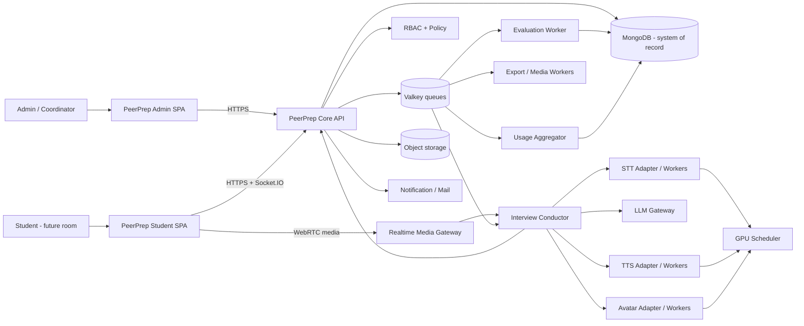
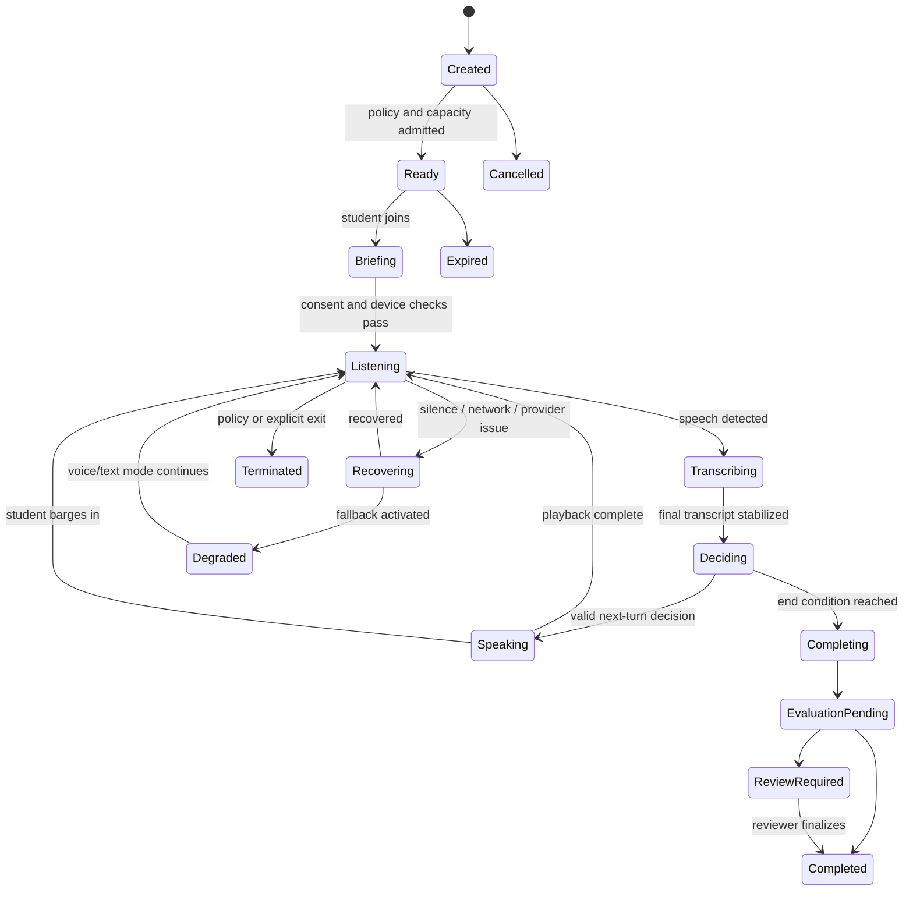
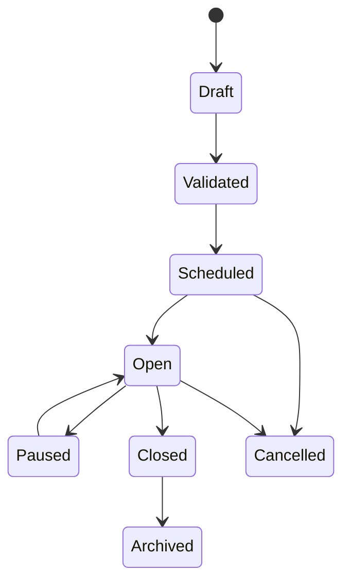
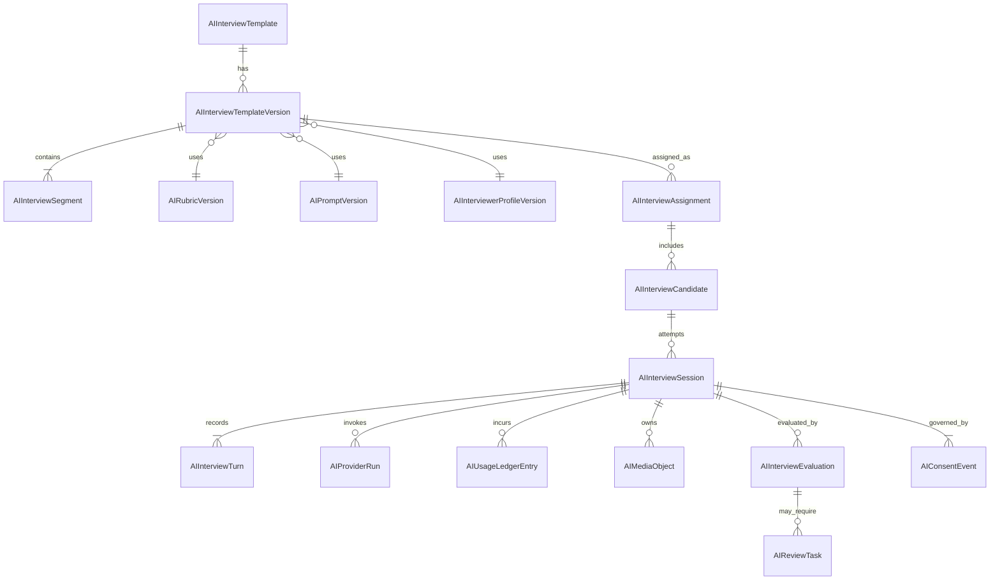

# PeerPrep AI Mock Interview - Admin Architecture and Product Plan

**Document type:** Planning and architecture only - no implementation specification is implied complete  
**Primary scope:** Administrator experience, technical services, data boundaries, and operational controls  
**Deferred scope:** Detailed student interview-room UX and implementation  
**Baseline date:** 25 September 2026  
**Status:** Proposed v1 design for review

---

## 1. Purpose

This document defines how PeerPrep should add an AI-based mock interview capability without replacing its existing human interview workflow or destabilizing the current platform.

It answers, in order:

1. What the product should and should not do.
2. Which services are required and why.
3. How the new capability fits the existing PeerPrep architecture.
4. How administrators create, validate, assign, monitor, and review AI interviews.
5. What data, APIs, queues, permissions, policies, and state machines are required.
6. How quality, cost, privacy, security, and scale will be controlled.
7. What should be delivered in each phase and what evidence is required before moving forward.

This is intentionally a design document. It does not authorize UI, API, database, infrastructure, or model implementation.

---

## 2. Source interpretation

The supplied PDFs and screenshots are reference inputs, not executable instructions and not a UI to copy.

### 2.1 Inputs used

- Current PeerPrep repository and architecture documentation.
- Current PeerPrep assessment and admin-report workflows.
- `PeerPrep_AI_Interview_Final_Technical_Report.pdf` as a proposed technical baseline.
- `AI-Mock Interview Platform | Graphic Era University.pdf` as competitor/reference research.
- Supplied reference screenshots showing test creation, section configuration, AI/manual question selection, weights, follow-ups, settings, avatar preview, and reporting navigation.

### 2.2 Interpretation rule

Ideas are adopted only when they fit PeerPrep's product, security, cost, and architecture. Names, page structure, visual composition, copy, and workflows from the reference platform must not be reproduced.

---

## 3. Executive decisions

| Area | Proposed decision | Status |
|---|---|---|
| Product position | Add AI interviews beside existing human mock interviews; do not replace human interviews. | Recommended |
| First release | Voice-first AI interview with transcript, adaptive follow-ups, structured evaluation, assignment, and admin review. | Recommended |
| Architecture style | Keep the existing modular monolith as system of record; add an isolated Python inference plane and dedicated workers. | Recommended |
| Runtime media | WebRTC for media transport where needed; Socket.IO for durable session/control events and recovery signals. | Validate in spike |
| Speech recognition | Faster-Whisper with a pinned Whisper large-v3-turbo-compatible model as the initial self-hosted candidate. | Benchmark gate |
| Turn detection | Silero VAD plus semantic endpointing rules; VAD alone must not decide that an answer is complete. | Benchmark gate |
| Speech synthesis | Chatterbox Multilingual V3 as the initial Hindi/English candidate; use a provider interface and a cloud fallback. | Benchmark gate |
| LLM | Provider-neutral adapter. Select primary and fallback snapshots only after quality/cost evaluation on PeerPrep data. | Open until benchmark |
| Avatar | Defer generated avatar video until voice reliability is proven. Later use curated motion clips plus live lip sync, always with static/voice fallback. | Recommended |
| Evaluation | Evidence-based, rubric-versioned, reviewable scoring; no automatic hiring or employability decision. | Required |
| Recordings | Off by default. Store transcript and derived metrics by default; raw audio/video only with explicit policy and consent. | Required |
| Cost control | Meter every session and enforce institution/template/session budgets and hard caps. | Required |
| Admin design | Use a dedicated AI Interview Studio with an explicit lifecycle rather than extending the current event form into one oversized screen. | Recommended |

### 3.1 One-sentence target architecture

PeerPrep remains the authoritative application, while a queue-backed AI interview subsystem coordinates provider-neutral LLM calls and separately scalable speech/avatar workers, with all templates, versions, assignments, sessions, evaluations, usage, and audit records governed from an admin studio.

---

## 4. Product boundaries

### 4.1 In scope for planning

- Admin dashboard and navigation.
- Interview templates and immutable published versions.
- Question strategy: curated, generated, or hybrid.
- Role, company, job description, experience, resume, language, and rubric context.
- Assignment to individual students, batches, groups, semesters, branches, or CSV cohorts.
- Voice conversation configuration and adaptive follow-ups.
- Approved interviewer profiles and future avatar configuration.
- Session monitoring, retries, fallbacks, and administrative intervention.
- Evaluation review, override, appeal notes, result release, exports, and analytics.
- Provider abstraction, inference services, queues, storage, observability, budgets, and audit.
- Consent, retention, safety, fairness, and human-review requirements.

### 4.2 Explicitly out of scope now

- Implementing any UI, route, schema, queue, model, or GPU service.
- Final student interview-room design.
- Automatic hire/reject, placement eligibility, personality, honesty, emotion, or deception inference.
- Continuous facial recognition or emotion recognition.
- Live full-body generative animation.
- Student-created voice cloning or custom avatar upload in v1.
- Treating LLM evaluation as unquestionable ground truth.
- Guaranteeing a concurrency number before load testing.

### 4.3 Product modes

PeerPrep should name and separate the modes clearly:

| Mode | Owner | Feedback during session | Result visibility | Intended use |
|---|---|---:|---|---|
| Guided Practice | Student or admin | Optional light coaching | Immediate by policy | Low-stakes improvement |
| Mock Interview | Admin | None | Admin release or immediate by policy | Realistic rehearsal |
| Institution Assessment | Admin | None | Admin review and release | Higher-stakes benchmarking, never automatic hiring |
| Human Interview | Existing workflow | Human-led | Existing policy | Mentor/peer interview |

The AI modes must remain visually and analytically distinguishable from the existing human interview workflow.

---

## 5. Principles

1. **Voice must work without an avatar.** Avatar failure cannot end an interview.
2. **The conductor owns state.** The LLM proposes content; deterministic application logic controls transitions, limits, retries, and completion.
3. **Published definitions are immutable.** Every session refers to exact template, rubric, prompt, provider, and avatar versions.
4. **Evidence before score.** A score must be traceable to transcript evidence and rubric criteria.
5. **Human review for consequential use.** Low-confidence, disputed, or institution-assessment results enter a review queue.
6. **Provider portability.** STT, TTS, LLM, and avatar engines sit behind internal contracts.
7. **Privacy by default.** Do not retain raw media unless the institution enables it and the student consents.
8. **Cost is a product constraint.** Admission control and fallback are normal runtime behavior.
9. **Accessible fallback is first-class.** Text captions, repeat, keyboard access, low-bandwidth voice-only mode, and approved accommodations are required.
10. **Do not equate presentation with ability.** Language fluency and delivery signals must not silently dominate technical evaluation.

---

## 6. Current PeerPrep fit

PeerPrep is currently a React/Vite frontend with a Node/Express modular monolith, MongoDB, Socket.IO, Valkey-backed workers, external object storage, mail queues, role-based access, assessments, analytics, and a human interview/event workflow.

### 6.1 Reuse

| Existing capability | AI interview use |
|---|---|
| JWT cookie authentication and server-side RBAC | Admin, coordinator, reviewer, and student authorization |
| Student directory and bulk lists | Candidate selection and cohort assignment |
| Coordinator permission model | Scoped AI interview operations |
| Assessment builder patterns | Validation, versioning concepts, preview, assignment, and report conventions |
| Valkey queue framework | Plan, evaluation, media, export, and notification jobs |
| Socket.IO | Session state and admin monitoring events |
| MongoDB | Templates, assignments, sessions, transcripts, evaluation metadata, usage ledger |
| Object storage | Consent-governed audio/video, exports, and versioned avatar assets |
| Email/notification services | Assignment, reminders, completion, review, and result-release notices |
| Activity/audit patterns | Administrator actions and version history |
| Existing analytics | Readiness and cohort views using published AI-interview outcomes |

### 6.2 Do not overload

- Do not store AI sessions in the current `Event`, `Pair`, or assessment-submission documents.
- Do not turn `EventManagement.jsx` into the AI interview builder.
- Do not run STT, TTS, avatar generation, or unbounded LLM calls inside the Express request process.
- Do not reuse assessment proctoring signals as interview scoring evidence without a separate approved policy.
- Do not persist large media blobs or data URLs in MongoDB.

---

## 7. Logical architecture



### 7.1 Deployment boundaries

| Deployable | Technology direction | Responsibility | Scaling |
|---|---|---|---|
| Admin and student web | Existing React/Vite app | Studio, monitoring, review, future interview room | CDN/static |
| Core API | Existing Node/Express service | Auth, CRUD, lifecycle, policy, assignment, audit, usage policy | Horizontal after existing hardening |
| Realtime media gateway | WebRTC-capable service; exact implementation selected by spike | Audio ingress/egress, reconnect, session media routing | Connection/session based |
| Interview conductor | Python or Node service; choose by prototype, isolated from core API | Deterministic turn state, context, provider calls, cancellation, fallback | Session/turn based |
| STT worker | Python/CUDA | Streaming/final transcript and confidence metadata | Queue wait and realtime factor |
| TTS worker | Python/CUDA | Streaming multilingual speech | Queue wait and first-audio latency |
| Avatar worker - later | Python/CUDA | Lip sync of approved assets while AI speaks | GPU seconds and queue wait |
| Evaluation worker | Worker with LLM adapter | Final evidence extraction and rubric scoring | Queue based |
| Export/media worker | Worker | Report export, media normalization, deletion | Queue based |
| Scheduler | Singleton/leased worker | Reminders, expiry, retention, aggregation | Singleton with lease |

### 7.2 Why not business microservices now

Identity, templates, assignment, reporting, and permissions belong in PeerPrep's existing system of record. Splitting them immediately would create distributed transactions and duplicate authorization. Only low-latency AI inference, media handling, and compute-heavy work need separate deployment and scaling boundaries.

---

## 8. Service selection approach

The attached technical report's model choices are a strong candidate set, but they are not final until tested with PeerPrep's actual Hindi, English, Hinglish, accent, latency, and cost data.

### 8.1 Selection matrix

| Capability | Initial candidate | Why it fits | Mandatory validation | Fallback |
|---|---|---|---|---|
| VAD | Silero VAD | Lightweight, stream-capable, permissive project license | Noise, long pauses, code-switching, false endpoint rate | Browser energy detector for UI only; server timeout rules |
| STT | Faster-Whisper + large-v3-turbo-compatible snapshot | Local deployment, timestamps, quantization, batching | WER by language/accent, streaming stability, names/technical terms, GPU cost | Cloud STT adapter |
| TTS | Chatterbox Multilingual V3 | Hindi and English coverage, reusable voice profile | Hinglish switching, pronunciation, time to first audio, hallucination/repetition, license review | Cloud TTS or neutral prerecorded system prompts |
| LLM | Cost-efficient primary model behind adapter | Structured questioning and evaluation | JSON reliability, follow-up quality, grounding, bias, latency, INR/session | Second provider and deterministic recovery prompts |
| Avatar | MuseTalk plus approved motion clips | Lip-sync direction without generating all body motion | Asset license chain, identity stability, 720p latency, GPU cost | Static portrait + TTS, then voice-only |
| Media | WebRTC candidate | Low-latency duplex audio and interruption | NAT/TURN cost, reconnect, weak networks, browser support | Buffered HTTPS/WebSocket audio mode |

### 8.2 Provider adapter contracts

Each AI provider adapter must expose a stable internal interface:

```text
STT.transcribeStream(audioChunks, languageHint, glossary) -> partials, final, timestamps, confidence
TTS.synthesizeStream(text, languageSegments, voiceVersion, controls) -> audioChunks, marks, usage
LLM.generateTurn(context, schema, budget) -> validated InterviewTurnDecision
LLM.evaluateSession(evidence, rubricVersion, schema, budget) -> validated EvaluationDraft
Avatar.renderSpeech(assetVersion, motionTag, audio, budget) -> videoStream or fallbackReason
```

Every response returns provider, model snapshot, latency, retry count, usage, estimated cost, and error category. Provider-specific payloads never leak into core domain records.

### 8.3 Benchmark before pinning

Build a blinded evaluation set containing:

- Indian English across multiple accents;
- Hindi and natural Hinglish code switching;
- technical terms, programming languages, company names, and common Indian names;
- strong, weak, incomplete, off-topic, memorized, and adversarial answers;
- noisy, quiet, low-bandwidth, interrupted, and long-pause audio;
- students with speech disabilities or approved accommodations where ethically and legally collected.

Primary/fallback selection must use a written scorecard: quality 35%, latency 20%, reliability 15%, cost 15%, privacy/data controls 10%, operational complexity 5%.

---

## 9. Interview conductor

The conductor is the core differentiator. It is a deterministic state machine that uses models as bounded tools.

### 9.1 Session state machine



### 9.2 Turn decision schema

The LLM may return only a validated structure such as:

```json
{
  "speech": "Could you explain the trade-off you made there?",
  "action": "FOLLOW_UP",
  "nextState": "LISTENING",
  "topicId": "system-design.scalability",
  "evidenceTags": ["tradeoff-mentioned"],
  "missingEvidence": ["measured-impact"],
  "expression": "analytical",
  "gesture": "none",
  "confidence": 0.82
}
```

The application rejects unknown actions, excess text, unsafe content, unrecognized topics, invalid transitions, or exhausted budgets.

### 9.3 Context strategy

Send only:

- immutable template/rubric/prompt identifiers;
- role, company, seniority, and approved job-description context;
- resume facts selected for this assignment, not the entire raw resume when unnecessary;
- current question, recent turns, rolling evidence summary, and remaining topic/time budget;
- language policy, accommodations, safety rules, and output schema;
- prior weak-area summary only when progression mode is explicitly enabled.

Do not resend the full transcript on every turn. Keep the original transcript authoritative and the rolling summary explicitly non-authoritative.

### 9.4 End conditions

The conductor ends when any configured condition is reached:

- hard duration;
- maximum turns/questions;
- required topic coverage achieved;
- student requests completion and policy allows it;
- unrecoverable media/provider failure after fallback attempts;
- administrator terminates a live session;
- safety policy requires termination.

---

## 10. Admin information architecture

Add a top-level **AI Interviews** module instead of placing AI configuration under Assessments or the existing human Interviews screen.

```text
AI Interviews
├── Overview
├── Templates
│   ├── All templates
│   ├── Create template
│   ├── Versions
│   └── Validation results
├── Assignments
│   ├── Draft / scheduled / live / closed
│   └── Candidate roster
├── Live Operations
├── Sessions
├── Review Queue
├── Reports & Analytics
├── Interviewer Profiles
│   ├── Voices
│   └── Avatars (phase 3)
├── Rubrics & Prompt Registry
├── Policies
│   ├── Consent and retention
│   ├── Cost and capacity
│   ├── Result release
│   └── Languages and accommodations
└── System Health
    ├── Providers
    ├── Queues / GPU capacity
    └── Usage / incidents
```

### 10.1 Permission catalogue

Extend coordinator permissions using granular server-enforced scopes:

| Permission | Meaning |
|---|---|
| `ai_interviews.view` | View templates, assignments, and permitted summaries |
| `ai_interviews.create` | Create draft templates |
| `ai_interviews.edit` | Edit drafts and create new versions |
| `ai_interviews.publish` | Publish immutable versions |
| `ai_interviews.assign` | Create assignments within academic scope |
| `ai_interviews.operate` | View live health and perform allowed recovery actions |
| `ai_interviews.review` | Review evidence and draft evaluation |
| `ai_interviews.override_score` | Change finalized scores with reason and audit |
| `ai_interviews.release_results` | Release reports to students |
| `ai_interviews.export` | Export authorized data |
| `ai_interviews.manage_profiles` | Configure approved voices/avatars |
| `ai_interviews.manage_policies` | Change institution-wide retention, budget, and provider policy - admin only by default |
| `ai_interviews.audit` | View immutable audit and model/version metadata |

Scopes also restrict college, course, branch, semester, group, assignment ownership, and data sensitivity.

---

## 11. Admin workflow A - create a template

Use a full-page stepper with autosaved drafts, not a long modal.

### 11.1 Step 1: Purpose and mode

**Inputs**

- Template name and internal code.
- Mode: Guided Practice, Mock Interview, or Institution Assessment.
- Objective and candidate-facing description.
- Owner/team and tags.
- Role, seniority/experience, job type, company context.
- Job description: paste, select stored version, or upload supported document.
- Expected duration and question range.

**System behavior**

- Detect missing or contradictory metadata.
- Extract JD competencies as suggestions only.
- Show estimated duration and baseline cost range.
- Save as `draft`; do not call paid models automatically.

### 11.2 Step 2: Interview blueprint

An interview contains ordered **segments**, not copied "question groups."

Example:

| Segment | Purpose | Time | Weight | Strategy |
|---|---|---:|---:|---|
| Opening | Introduction and candidate comfort | 1 min | 0% | Fixed |
| Resume evidence | Validate selected experience | 3 min | 20% | Hybrid |
| Technical depth | Role-specific knowledge | 6 min | 45% | Adaptive |
| Behavioral scenario | Structure and judgment | 3 min | 25% | Adaptive |
| Candidate questions | Student asks interviewer | 1 min | 0% | Fixed |
| Closing | End and explain next steps | 1 min | 10% or 0% | Fixed |

For each segment configure:

- objective and evidence sought;
- topic/skill taxonomy;
- time and follow-up budget;
- difficulty and progression rule;
- fixed question, approved question pool, generated-at-publish pool, or runtime adaptive strategy;
- repeat, skip, hint, and silence behavior;
- rubric dimensions and weight contribution.

Validation requires total scoring weight = 100% and total segment time within the session hard cap.

### 11.3 Step 3: Questions and follow-ups

Three controlled strategies:

| Strategy | Meaning | Best use |
|---|---|---|
| Curated | Admin selects exact approved questions | Comparability and high-stakes use |
| Generated pool | AI proposes questions during authoring; admin reviews and freezes them | Faster authoring with repeatability |
| Runtime adaptive | Conductor creates bounded follow-ups from evidence gaps | Practice and conversational depth |

Admin controls:

- question pool and exclusions;
- allowed follow-up count per main question and entire interview;
- topics that must/must not be probed;
- banned, sensitive, or discriminatory question classes;
- maximum question length;
- language behavior;
- duplicate/similarity check;
- expected evidence, ideal-answer notes, and reviewer guidance.

Generated questions never become active without preview, validation, and a frozen template version.

### 11.4 Step 4: Rubric and evaluation

Provide an explicit rubric builder:

| Dimension | Suggested default | Guardrail |
|---|---:|---|
| Technical / role knowledge | 30% | Must cite answer evidence |
| Relevance and structure | 20% | Do not reward verbosity |
| Communication clarity | 15% | Separate language proficiency from knowledge |
| Fluency | 10% | Disable or reduce for accommodations |
| Confidence indicators | 10% | Speech consistency only; no emotion inference |
| Resume / JD alignment | 10% | Use only verified/provided facts |
| Professionalism | 5% | Behavior and language, not appearance |

Admin may change dimensions, anchors, weights, minimum evidence, and whether manual review is mandatory. Each level must include behavioral anchors, for example what 1, 3, and 5 mean.

Required policies:

- score range and rounding;
- minimum evidence per dimension;
- not-observed handling;
- low-confidence threshold;
- overall and sectional thresholds;
- whether a score is coaching-only or institution-visible;
- whether score override requires one or two reviewers.

### 11.5 Step 5: Conversation and language

- Allowed languages: English, Hindi, Hinglish for v1 pilot.
- Initial language and whether automatic switching is allowed.
- Technical term glossary and pronunciation dictionary.
- Pause style and acknowledgement frequency.
- Answer soft/hard duration limits.
- Silence prompt, repeat, and skip thresholds.
- Interruption/barge-in behavior.
- Caption visibility.
- Low-confidence transcription confirmation rules.
- Accessibility accommodations.

### 11.6 Step 6: Interviewer profile

For voice MVP:

- approved interviewer identity;
- voice version;
- tone: neutral, warm, analytical, concise;
- speech speed within safe bounds;
- pronunciation preview in all enabled languages;
- voice-only and static portrait fallback.

For phase 3 avatar:

- approved presenter version and background;
- restrained gesture policy;
- network/GPU fallback order;
- preview clips and QA result.

Admins choose only approved profiles. Custom voice cloning and presenter upload remain disabled in v1.

### 11.7 Step 7: Policy, privacy, and results

- Microphone, camera, and recording requirements separately.
- Raw audio/video retention: disabled, or explicit days with purpose.
- Transcript/evaluation retention.
- Student notice and consent text version.
- Resume fields allowed in the session.
- Human-review policy.
- Result release: immediate, after review, scheduled, or never student-visible.
- Question/answer visibility after completion.
- Retry and reschedule policy.
- Cost warning and hard cap.
- Per-session fallback policy.

The page must show a concise "What will be collected" summary generated from policy configuration.

### 11.8 Step 8: Preview and validation

Validation categories:

- blocking errors;
- safety/privacy blockers;
- quality warnings;
- cost/capacity warnings;
- accessibility warnings;
- informational recommendations.

Preview options:

- candidate-facing briefing preview;
- interview script simulation;
- one-turn live voice test;
- English/Hindi/Hinglish pronunciation test;
- rubric dry-run on stored synthetic answers;
- estimated time/cost and required GPU capacity;
- complete immutable configuration diff from prior version.

### 11.9 Step 9: Publish

Publishing creates an immutable `AIInterviewTemplateVersion`. Editing a published template creates a new draft version. Existing assignments and sessions remain bound to their original version.

Required publish checklist:

- all validators pass;
- weight and time budgets are valid;
- rubric and prompt versions are frozen;
- provider policy and fallback are available;
- consent notice is selected;
- retention is explicit;
- reviewer requirement is staffed;
- cost cap is defined;
- enabled languages passed preview;
- audit reason is recorded.

---

## 12. Admin workflow B - create an assignment

Assignment is separate from template creation so one immutable template can serve multiple cohorts and schedules.

### 12.1 Assignment inputs

- Published template version.
- Assignment name and owner.
- Candidate selection: individuals, batch, group, course/branch/semester filters, saved cohort, or validated CSV.
- Availability window and timezone.
- Appointment slots or flexible completion window.
- Attempt limit, cooldown, reschedule, and incomplete-session policy.
- Candidate-specific resume context requirement.
- Allowed devices/network requirement.
- Result-release and notification policy, optionally narrower than template defaults.
- Budget allocation: total, per student, and warning thresholds.
- Concurrency/admission policy.

### 12.2 Preflight estimate

Before activation, show:

- assigned candidate count;
- expected sessions and GPU-minutes;
- estimated minimum/expected/maximum cost;
- peak concurrency based on slots;
- available tested capacity;
- reviewers needed and expected queue volume;
- missing resumes/consents/accommodations;
- notification count.

Activation is blocked if expected concurrency exceeds the configured safe limit without an allowed fallback.

### 12.3 Assignment lifecycle



Changes after opening are limited. Material policy/template changes require a new assignment or version; they must not silently alter sessions already started.

---

## 13. Admin workflow C - live operations

The live-operations page is an operational dashboard, not a surveillance wall.

### 13.1 Summary

- scheduled, waiting, active, degraded, recovering, completed, failed;
- median/p95 start and turn latency;
- STT/TTS/LLM/avatar provider health;
- queue wait, GPU utilization, active capacity, and fallback rate;
- current and projected assignment cost;
- incidents and students requiring support.

### 13.2 Session row

- candidate identity within administrator scope;
- assignment/template version;
- start time, elapsed time, language, current segment;
- connection state and last heartbeat;
- mode: full avatar, static+voice, voice-only, or text recovery;
- latency and error badges;
- consent/recording state without exposing raw media by default;
- support action history.

### 13.3 Allowed operations

- send a non-content system message;
- allow reconnect or extend join window;
- switch to approved fallback;
- retry a failed infrastructure step idempotently;
- terminate for a documented reason;
- flag for technical or human review;
- create a support incident.

Admins cannot secretly speak as the AI, alter transcripts, or change the rubric during a live session.

---

## 14. Admin workflow D - review and result release

### 14.1 Review queue routing

A session enters review when:

- assignment policy requires review;
- STT or evaluation confidence is below threshold;
- transcript contains unresolved low-confidence critical facts;
- rubric evidence is insufficient;
- provider/model validation fails;
- session used extended fallback;
- candidate disputes the result;
- safety or fairness rule flags the evaluation;
- random quality-control sampling selects it.

### 14.2 Review workspace

Use a three-panel workspace:

```text
┌──────────────────┬────────────────────────────┬──────────────────────┐
│ Session outline  │ Transcript and evidence    │ Rubric decision      │
│ questions/turns  │ synchronized by turn       │ score + reviewer note│
└──────────────────┴────────────────────────────┴──────────────────────┘
```

Required features:

- transcript confidence and corrected-text workflow;
- exact evidence attached to each rubric score;
- model-generated feedback visibly labeled as a draft;
- compare AI score and reviewer score;
- reason required for override;
- no destructive replacement of original output;
- second review when policy requires it;
- audit timeline including versions and providers;
- candidate-facing redaction preview;
- approve, return for re-evaluation, invalidate, or finalize.

### 14.3 Result states

```text
evaluation_pending -> draft_ready -> review_required -> finalized -> released
                                      |                  |
                                      +-> invalidated    +-> revised -> released
```

Revisions create a new evaluation revision and retain prior revisions.

---

## 15. Admin pages

### 15.1 Overview

- KPIs: active assignments, completion, review backlog, median score, estimated spend, fallback rate.
- Trends: completion, cost/session, turn latency, review rate.
- Attention list: capacity risk, failed sessions, expiring assignments, unreleased results.
- Shortcuts: create template, create assignment, open review queue.

### 15.2 Templates list

Columns: name, mode, role, languages, current version, status, owner, last validated, assignments, average cost, updated. Filters include ownership, status, mode, role, language, and validation state.

### 15.3 Template detail

Tabs: Overview, Blueprint, Questions, Rubric, Conversation, Policy, Versions, Validation, Usage. Primary actions depend on state: edit draft, validate, publish, create version, assign, archive.

### 15.4 Assignments list/detail

Tabs: Overview, Candidates, Schedule, Sessions, Costs, Notifications, Results, Audit. Bulk operations must preview affected records and require explicit confirmation.

### 15.5 Review queue

Filters: assignment, reason, confidence, language, age, reviewer, status, score difference, fallback mode. Support claim/lease so two reviewers do not edit simultaneously.

### 15.6 Reports and analytics

- Completion funnel.
- Score distribution with sample size.
- Rubric heatmap.
- Question/segment difficulty and evidence coverage.
- Progress across attempts using comparable rubric versions only.
- Language and network quality slices for fairness/quality monitoring.
- Review/override rate.
- Cost and latency trends.
- Export with permissions, purpose, redaction, and audit.

Do not produce ranks across incomparable templates, rubrics, languages, or versions.

### 15.7 Policies

Institution-level defaults with assignment overrides only where allowed:

- consent notices;
- retention and deletion;
- media recording;
- reviewer requirements;
- provider regions/data retention;
- approved languages;
- cost ceilings;
- capacity and fallback;
- result release;
- accommodations;
- incident contacts.

### 15.8 System health

- adapter/provider health and circuit-breaker state;
- queue depth, oldest job age, retry and dead-letter count;
- GPU worker version, readiness, utilization, memory, and loaded models;
- model/prompt/rubric versions currently in use;
- p50/p95/p99 latency per pipeline stage;
- error rate and fallback reasons;
- daily/monthly usage and budget consumption.

---

## 16. Domain model

### 16.1 Core entities

| Entity | Responsibility |
|---|---|
| `AIInterviewTemplate` | Stable identity, ownership, current status, tags |
| `AIInterviewTemplateVersion` | Immutable complete published definition |
| `AIInterviewSegment` | Ordered objective, timing, question strategy, evidence, weight |
| `AIQuestion` / `AIQuestionVersion` | Curated/generated question with provenance and review state |
| `AIRubric` / `AIRubricVersion` | Dimensions, anchors, weights, evidence, review rules |
| `AIPromptVersion` | Versioned prompt blocks, schema, checksum, approval |
| `AIInterviewerProfile` / `Version` | Approved persona, behavior, voice, avatar, languages |
| `AIInterviewAssignment` | Cohort, schedule, attempts, budget, policy overrides |
| `AIInterviewCandidate` | Per-candidate assignment state and resume/context binding |
| `AIInterviewSession` | Immutable session binding, state, fallback, timing, totals |
| `AIInterviewTurn` | Append-only speaker turn, transcript versions, decision, latency |
| `AIInterviewEvaluation` | Versioned draft/final evaluation and evidence references |
| `AIReviewTask` | Reason, priority, claim lease, reviewer decision |
| `AIConsentEvent` | Notice version, scopes, decision, timestamp, context |
| `AIUsageLedgerEntry` | Provider/model units, GPU seconds, storage, estimated/actual cost |
| `AIMediaObject` | Storage key, type, consent basis, encryption, retention, deletion state |
| `AIProviderRun` | Request id, adapter/model version, result category, usage, latency |
| `AIInterviewAuditEvent` | Append-only actor/action/resource/before-after metadata |
| `AIIncident` | Operational or safety incident, impact, response, resolution |

### 16.2 Relationship outline



### 16.3 Data rules

- Turns, consent, ledger entries, and audit events are append-only.
- Corrections add transcript/evaluation revisions; they never delete original model output.
- A session stores exact version IDs and checksums.
- Media metadata lives in MongoDB; media bytes live in object storage.
- Candidate context is snapshotted or checksum-bound at session start so later resume edits do not rewrite history.
- Personally identifying data is not copied into analytics aggregates unless required.
- Cross-entity state changes use transactions where possible and an outbox for asynchronous side effects.

---

## 17. API surface - conceptual

Use `/api/v1/ai-interviews` and split route modules by actor. This table defines responsibilities, not final payloads.

### 17.1 Admin template and registry APIs

```text
GET    /admin/templates
POST   /admin/templates
GET    /admin/templates/:templateId
PATCH  /admin/templates/:templateId/draft
POST   /admin/templates/:templateId/validate
POST   /admin/templates/:templateId/preview
POST   /admin/templates/:templateId/publish
POST   /admin/templates/:templateId/versions
GET    /admin/templates/:templateId/versions

GET    /admin/rubrics
POST   /admin/rubrics
POST   /admin/rubrics/:rubricId/publish
GET    /admin/interviewer-profiles
POST   /admin/interviewer-profiles/:profileId/preview
POST   /admin/interviewer-profiles/:profileId/publish
```

### 17.2 Admin assignment and operations APIs

```text
GET    /admin/assignments
POST   /admin/assignments
POST   /admin/assignments/:id/preflight
POST   /admin/assignments/:id/activate
POST   /admin/assignments/:id/pause
POST   /admin/assignments/:id/close
POST   /admin/assignments/:id/candidates/validate
POST   /admin/assignments/:id/candidates
GET    /admin/assignments/:id/sessions
GET    /admin/live
POST   /admin/sessions/:id/fallback
POST   /admin/sessions/:id/terminate
POST   /admin/sessions/:id/flag-review
```

### 17.3 Review and reporting APIs

```text
GET    /admin/reviews
POST   /admin/reviews/:id/claim
POST   /admin/reviews/:id/release
POST   /admin/reviews/:id/decision
POST   /admin/evaluations/:id/revise
POST   /admin/evaluations/:id/finalize
POST   /admin/results/release
GET    /admin/analytics
POST   /admin/exports
GET    /admin/usage
GET    /admin/system-health
```

### 17.4 Contract requirements

- Idempotency key on create, publish, activate, retry, finalize, release, and export commands.
- Optimistic concurrency/version token on draft updates.
- Request ID and actor context on every call.
- Cursor pagination on high-cardinality lists.
- Purpose and reason on sensitive export/override/termination actions.
- Uniform error categories; never return provider secrets or raw stack traces.
- API returns durable state; Socket.IO events only prompt clients to refetch/reconcile.

---

## 18. Realtime and queue contracts

### 18.1 Realtime events

```text
session.ready
session.state_changed
turn.listening
transcript.partial
transcript.final
ai.thinking
ai.speaking
ai.interrupted
fallback.activated
session.recovering
session.completed
evaluation.ready
review.required
usage.threshold_reached
incident.created
```

Each event includes `eventId`, `sessionId`, monotonic `sequence`, `occurredAt`, `stateVersion`, and a minimal payload. Clients deduplicate by event ID and reconcile gaps through REST.

### 18.2 Queue topology

| Queue | Work | Priority / deadline behavior |
|---|---|---|
| `ai-session-admission` | Capacity and policy admission | Immediate |
| `ai-turn-stt` | Final transcript work | Realtime deadline |
| `ai-turn-decision` | LLM next-turn decision | Realtime deadline |
| `ai-turn-tts` | Speech synthesis | Realtime deadline |
| `ai-turn-avatar` | Lip-sync frames | Best effort; degradable |
| `ai-evaluation` | Final scoring/feedback | Async high |
| `ai-review-routing` | Create/assign review tasks | Async high |
| `ai-media` | Normalize, scan, retain/delete | Async |
| `ai-export` | Authorized report exports | Async |
| `ai-usage` | Cost/usage aggregation | Async |

Realtime jobs use short deadlines. If they miss the deadline, the conductor uses the configured fallback instead of allowing stale output to play.

### 18.3 Reliability

- At-least-once delivery with idempotent handlers.
- Job ID derived from session/turn/action/version.
- Retry only transient categories with bounded exponential backoff.
- No automatic retry after a possibly billable ambiguous provider success without reconciliation.
- Dead-letter queue with safe replay tooling.
- Circuit breaker per provider/model/region.
- Lease and heartbeat for long GPU jobs.
- Cancellation propagation for barge-in and ended sessions.

---

## 19. Evaluation architecture

### 19.1 Two-stage evaluation

1. **Evidence extraction:** identify claims, examples, correctness signals, structure, and missing evidence per turn.
2. **Rubric scoring:** score only from extracted evidence against immutable anchors.

Keep conversational turn generation separate from final evaluation. The interviewer model should not be the sole judge of its own conversation.

### 19.2 Evaluation output

```text
dimension score
confidence
evidence turn references
positive evidence
missing/contradictory evidence
coaching feedback
improved-answer example clearly labelled as generated
review reason, if any
model/prompt/rubric versions
```

### 19.3 Score governance

- No score without evidence references.
- `not_observed` is valid and not automatically zero.
- Low-confidence dimensions route to review.
- Technical correctness may use approved reference material or deterministic checks where available.
- Fluency and confidence can be excluded for accommodations.
- Resume alignment does not reward prestigious employers, colleges, names, gender, location, or socioeconomic proxies.
- Aggregate comparisons require minimum cohort size and comparable template/rubric versions.

### 19.4 Quality metrics

- Human-model score agreement by dimension.
- Reviewer override rate and direction.
- Unsupported-evidence rate.
- Inter-reviewer agreement.
- WER and critical-entity error rate by language/accent.
- Score difference by language, network quality, accommodation, and other lawfully evaluated cohorts.
- Candidate dispute rate and upheld-dispute rate.

---

## 20. Security, privacy, and responsible AI

### 20.1 Trust boundaries

- Browser, uploaded resume/JD, transcript, generated text, and model output are untrusted input.
- Core API is the policy enforcement point.
- Inference workers receive short-lived, least-privilege access and only required context.
- GPU workers cannot query the main database directly.
- Object access uses signed, short-lived URLs or service identities.
- Provider credentials never enter browser payloads or MongoDB records.

### 20.2 Required controls

- Separate mic, camera, and recording consent.
- Versioned consent text and append-only consent events.
- TLS, encrypted storage, managed secrets, key rotation.
- Strict MIME/content validation and malware scanning for uploads.
- Prompt-injection defenses: delimit candidate/resume/JD content, use structured schemas, and never let content change system policy.
- Output validation, moderation, and banned-question checks.
- Server-side RBAC plus resource scope checks.
- Signed media URLs, access logs, and download restrictions.
- Retention/deletion jobs with verifiable tombstone status.
- Audit for publish, assignment, access, export, override, release, deletion, and policy changes.
- Data-processing inventory for every external provider, including region, retention, training use, and subprocessors.

### 20.3 Prohibited use

- Emotion, honesty, personality, mental state, protected-class, or employability inference from face/voice.
- Appearance, clothing, camera background, eye contact, or accent as hidden score proxies.
- Fully automated adverse academic or employment decisions.
- Training models on student data without separate explicit authorization and governance.
- Reusing raw recordings for unrelated purposes.

### 20.4 Release blockers

- No approved retention/deletion policy.
- No versioned consent attached to sessions.
- No language/accent benchmark.
- No human review and appeal path for institution assessments.
- Missing prompt/rubric/model version audit.
- No media/provider incident playbook.
- No tested fallback for GPU/provider outage.

---

## 21. Capacity, fallback, and cost

### 21.1 Admission control

At session start, reserve capacity for the configured mode. If full avatar capacity is unavailable:

```text
full avatar -> static portrait + voice -> voice-only -> text-assisted recovery
```

The UI explains the change. A fallback does not change evaluation criteria unless media quality makes evidence unreliable; in that case review is required.

### 21.2 Cost ledger

Record append-only usage by session, turn, provider, model, and job:

- input/output tokens;
- STT audio seconds;
- TTS characters/audio seconds;
- GPU milliseconds by model;
- avatar rendered seconds;
- storage byte-days and transfer;
- retries, cache hits, and waste from cancellation;
- list/negotiated unit price version;
- estimated and reconciled INR.

### 21.3 Budget hierarchy

```text
institution monthly budget
  -> assignment budget
     -> candidate/attempt budget
        -> turn/provider operation budget
```

Soft threshold warns and can force cheaper providers/fallbacks. Hard threshold blocks new work or requires an audited admin override; it never cuts off a student mid-answer without a recovery path.

### 21.4 Pilot targets

Treat the attached INR 10-15 per 15-minute interview as a hypothesis, not a commitment. Validate through at least 100 representative sessions.

Initial service objectives:

| Metric | Pilot target |
|---|---:|
| Session start success | >= 99% in controlled pilot |
| First playable interviewer audio | median < 2.5 s end-to-end |
| Barge-in stop acknowledgement | target < 300 ms |
| Session recovery after brief disconnect | >= 95% within configured window |
| Lost finalized turns | 0 |
| Evaluation with evidence references | 100% |
| Usage ledger coverage | 100% of billable/provider operations |

Publish concurrency only after separate voice-only, avatar-only, and combined load tests.

---

## 22. Observability and operations

### 22.1 Correlation

Use `requestId`, `sessionId`, `turnId`, `jobId`, and `providerRunId` across API logs, queues, inference traces, usage, and audit. Never log raw resume text, complete transcript, audio, or secrets in general application logs.

### 22.2 Metrics

- session starts/completions/failures;
- state duration and recovery count;
- turn latency broken into VAD, upload, STT, LLM, TTS, avatar, and playback;
- queue depth/age and dead letters;
- GPU utilization, VRAM, model-load time, out-of-memory events;
- provider error/timeout/schema-failure rate;
- WER sample results and transcript correction rate;
- evaluation confidence/review/override rate;
- fallback reason/rate;
- spend, cost/session, cost/minute, and budget forecast.

### 22.3 Alerts

- session start or turn latency SLO burn;
- provider circuit open;
- oldest realtime queue job beyond deadline;
- repeated GPU OOM/crash;
- usage spike or budget threshold;
- deletion/retention job failure;
- audit/outbox lag;
- unusually high review or override rate after a model/prompt version change.

### 22.4 Operational playbooks

- provider outage;
- GPU worker loss;
- queue backlog;
- weak network/reconnect;
- incorrect or harmful interviewer response;
- hallucinated evaluation;
- leaked media or signed URL;
- cost runaway;
- model rollback;
- assignment cancellation and student rescheduling.

---

## 23. Competitor/reference comparison

The comparison focuses on concepts, not duplication.

| Reference concept observed | PeerPrep decision | Difference / improvement |
|---|---|---|
| Admin creates test and sections | Template plus ordered interview blueprint | Separates reusable immutable template from cohort assignment |
| Automated or manual questions | Curated, generated-at-authoring, or runtime adaptive | Adds provenance, review, versioning, and risk-based limits |
| Question groups and weights | Segments, evidence objectives, and rubric contribution | Time, topic, follow-up, and evidence budgets are explicit |
| Job role/company/JD context | Structured context with snapshot/checksum | Minimizes context and preserves historical reproducibility |
| Resume scoring insight | Optional resume evidence segment | No opaque resume score; evidence and weight are reviewable |
| Follow-up question toggle | Bounded follow-up policy per segment/question | Triggered by missing evidence, not an unrestricted switch |
| Multilingual mode | Versioned language policy and benchmarks | Language-specific QA, glossary, accommodations, and fallback |
| Question replay / short-answer handling | Repeat/clarify/skip and silence policies | Conversation-aware rather than test-player controls |
| Avatar preview | Approved interviewer profile and versioned assets | Voice-first; avatar is degradable and separately governed |
| Admin reports and leaderboard | Reviewable reports and comparable cohort analytics | Avoid ranks across incomparable rubrics/templates |
| Pro tips/practice assistance | Separate Guided Practice product mode | Cannot leak into Mock Interview or Institution Assessment |

### 23.1 Ideas intentionally rejected

- Copying the reference navigation, visual design, labels, forms, or page composition.
- One oversized screen containing template, questions, assignment, and policy.
- Treating avatar appearance or facial behavior as performance evidence.
- A generic "AI answer check" toggle without a defined rubric, provenance, confidence, and review path.
- Immediate leaderboards without comparability and minimum-cohort rules.

---

## 24. Delivery roadmap and gates

### Phase 0 - discovery and proof

**Deliverables**

- Approve product boundaries, vocabulary, permissions, and domain model.
- Build evaluation datasets and human rating guide.
- Prototype VAD/STT/TTS/LLM adapters outside production.
- Run WebRTC/media and reconnect spike.
- Validate model/dependency licenses and provider data terms.
- Define consent, retention, appeal, and incident policies.

**Exit gate**

- Written benchmark and architecture decision records approve each candidate.
- No unresolved legal/privacy release blocker.
- Measured latency/cost envelope supports voice MVP.

### Phase 1 - admin foundation and voice MVP

**Deliverables**

- Admin template, rubric, validation, version, assignment, and usage designs.
- Voice-only session orchestration.
- English/Hindi/Hinglish transcript and adaptive follow-up.
- Evaluation draft, review queue, result release, audit, and cost ledger.
- Static interviewer image and voice-only fallback.

**Exit gate**

- 100-session pilot meets agreed quality, latency, stability, fairness, cost, privacy, and reviewer-override thresholds.

### Phase 2 - institution operations

**Deliverables**

- Batch scheduling, capacity preflight, live operations, exports, notifications.
- Cohort analytics, progress, review leases, appeals, and policy administration.
- Coordinator scopes and full audit.

**Exit gate**

- Admin/coordinator UAT passes; no authorization leakage; reports reconcile with sessions and evaluations.

### Phase 3 - avatar experience

**Deliverables**

- Three centrally approved interviewer profiles.
- Versioned assets, restrained motion library, multilingual previews.
- Live lip sync only while AI speaks.
- Automatic static/voice fallback.

**Exit gate**

- Identity stability, asset provenance, lip sync, transition quality, latency, accessibility, GPU capacity, and unit cost pass review.

### Phase 4 - production scale

**Deliverables**

- Horizontally scaled workers and media gateways.
- Autoscaling from queue wait/deadline and reservation demand.
- Multi-zone recovery as required, backups, restore tests, DR, privacy audit.
- Provider failover and model rollback drills.

**Exit gate**

- Published concurrency survives load/failure testing with no lost finalized turns and acceptable fallback rate.

---

## 25. Architecture decision records required before implementation

| ADR | Decision |
|---|---|
| ADR-AI-001 | Modular-monolith ownership versus separate inference plane |
| ADR-AI-002 | WebRTC/media gateway choice and fallback transport |
| ADR-AI-003 | Interview conductor runtime and state persistence |
| ADR-AI-004 | STT primary/fallback benchmark result |
| ADR-AI-005 | TTS voice, language, and fallback benchmark result |
| ADR-AI-006 | LLM primary/fallback, structured output, and evaluation separation |
| ADR-AI-007 | Prompt/rubric registry and immutable version semantics |
| ADR-AI-008 | Media recording, storage, retention, and deletion |
| ADR-AI-009 | Cost ledger price versioning and hard-cap behavior |
| ADR-AI-010 | Human review, override, release, and appeal policy |
| ADR-AI-011 | Avatar asset provenance and runtime design |
| ADR-AI-012 | Analytics comparability and fairness thresholds |

---

## 26. Planning acceptance checklist

The design phase is complete only when stakeholders approve:

- [ ] Product modes and terminology.
- [ ] Admin information architecture and page inventory.
- [ ] Template and assignment separation.
- [ ] Blueprint, question, rubric, language, policy, preview, and publish workflows.
- [ ] Permissions and academic scopes.
- [ ] Domain entities, immutability, and retention rules.
- [ ] API, realtime event, and queue boundaries.
- [ ] Provider abstraction and benchmark scorecard.
- [ ] Review, override, result release, and appeal rules.
- [ ] Consent, recording, privacy, prohibited-use, and incident policies.
- [ ] Cost budget hierarchy, capacity reservation, and fallback order.
- [ ] Pilot SLOs and exit gates.
- [ ] Phase order: voice quality before avatar investment.

---

## 27. Open product decisions

These require stakeholder choice before implementation planning can become final:

1. Is Institution Assessment part of v1, or should v1 remain coaching-only?
2. Is camera required for any v1 mode, or is microphone-only the default?
3. Which raw media, if any, may be retained, for how long, and for what purpose?
4. Can coordinators publish templates, or only create drafts for admin approval?
5. Which templates require mandatory human review before result release?
6. Are students allowed to retry immediately, after a cooldown, or only by reassignment?
7. Is resume context opt-in per student or institution-required for specific assignments?
8. What monthly and per-session budget may trigger degradation or block new sessions?
9. Which languages must pass the first pilot beyond English, Hindi, and Hinglish?
10. What is the minimum acceptable human-model agreement per rubric dimension?

---

## 28. Recommended next planning artifact

Do not begin implementation from this document alone. The next artifact should be a screen-by-screen **Admin AI Interview UX specification** covering routes, wireframes, field definitions, validation messages, empty/loading/error states, responsive behavior, and permission variants. After that, create the ADRs and API/schema contracts for Phase 1.

---

## 29. Technical references

These primary project references confirm candidate capabilities but do not replace PeerPrep benchmarking or legal review:

- Faster-Whisper: <https://github.com/SYSTRAN/faster-whisper>
- Silero VAD: <https://github.com/snakers4/silero-vad>
- Chatterbox: <https://github.com/resemble-ai/chatterbox>
- MuseTalk: <https://github.com/TMElyralab/MuseTalk>

Exact releases, model weights, dependency licenses, CUDA/runtime compatibility, provider prices, and data-processing terms must be pinned and recorded at implementation time.
